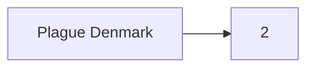

I started the morning off by thinking of a new way to make notes on Mobile.

I tried using the app Termux to install git in the command line way. But I hit permissions errors. Termux only has rw permissions in it's install directory /data/.com.termux . So that's not going to work.

The git functionality of gitjournal is excellent, it's the "journal" part that is lacking. I changed settings in gitjournal to save the repo to an external location. I then downloaded the app markor and pointed it to that directory.

The edits I make in markor are detected by the editor in gitjournal. But git won't push he changes unless I make an edit in the gitjournal app. If I'm only editing one file, that's fine for now.

 Since I'm regularly using scratch, I might want to link the daily note [2021-03-25](2021-03-25.md). It appears that markor uses classic markdown link notation. I wonder if I can change it to wiki links?

I've updated my query filters on the daily notes to better match due today and upcoming.

I think I'd like to make the [[PhD timeline]] it's own file and link it to the daily notes. Check out [[2021-03-25]] for when this starts as an example. I would also really like to be able to use internal links within mermaid diagrams. Here's an [example](https://forum.obsidian.md/t/obsidian-links-in-mermaid/2965/8):



Wow, this example also taught me how to make Left-Right graphs 😂. So that's what "graph TD" means in my other code. Unfortunately, gantt diagrams don't support internal links yet, but I can follow [this forum](https://forum.obsidian.md/t/how-to-set-internal-links-in-gantt-chart/13903) for updates.

According to the timeline I should be focused on writing [[Manuscript]] drafts for paper 2 and paper 3.

## [[Plague Denmark]] Updates

Ravneet mentioned getting and error that the output of ```samtools view``` is not a BAM file. I'm wondering if her file is a SAM file instead.


Ravneet also mentioned that all of our samples are low [[Coverage]] for the [[pPCP1]] [[Plasmid]] which is very strange.

/home/poinarlab/Projects/Plague/Denmark/mapping/Plague/merged/P212

> Hi Ravneet,
> 
> 1. **BAM file errors**.
>   Are you sure your file is in BAM format and not SAM format? The easy way would be to run ```head``` on your file. If it outputs human readable text, it's a SAM file. To make samtools output BAM format, your command would need the -b flag like ```samtools view -b ```. Is this revelant?
> 2. **pPCP1 Depth of Coverage**
>   That is very odd about the lower coverage... our original qualimap output says [[pPCP1]] is very high in some samples. For example looking at the [[Qualimap]] output for P212. It indicates that the [[pPCP1]] depth for this sample is 149x.
>   ```yaml
>     file: /home/poinarlab/Projects/Plague/Denmark/mapping/Plague/merged/P212/genome_results.txt
>   ```

| Replicon | Locus | Length  | Mapped Bases | Mean Depth | Standard Deviation |
|:--------:|:-----:|:-------:|:------------:|:----------:|:------------------:|
| AL590842 | Chrom | 4653728 |   42269215   |   9.083    |       11.70        |
| AL117189 | pCD1  |  70305  |   3014473    |   42.88    |       43.95        |
| AL117211 | pMT1  |  96210  |   1143300    |   11.88    |       18.44        |
| AL109969 | pPCP1 |  9612   |   1435273    |   149.32   |       184.12       |


> 3. **Chromosome Resequencing Experiment Update**
 Attached is the MultiQC output but it is not fun to look at :( My short summary is:
 The following enriched libraries are good candidates for resequencing:
>    - D24, D62, D72, R21
>    - The threshold of 50% coverage at 3X is a relatively good predictor of reaching the minimum number of informative SNPs for phylogenetic applications.
>    - All of the libraries that Ravneet has enriched have drastically better complexity than libraries enriched by Katherine :)
>   
>    If you're interested, I typed up a [report](https://raw.githack.com/ktmeaton/obsidian/master/phd/pandoc/Chromosome%20Resequencing%20Github.html) of the details with charts.
>
>Cheers,
Kat

I've hit a problem with [[Obsidian]]. I need a way to publish or convert the output. I don't really want to pay $8/month for the publishing service. So that's what I'll need to investigate tomorrow. My needs are:

- Conversion: pdf, Word Doc, HTML
- Anticipated Issues: Wiki links instead of markdown links.

Theoretically, pandoc should be able to do this. I'll pick that up tomorrow.

- #⬜/✨  | [[2021-03-26]] | Figure out how to convert obsidian markdown notes.

Also this reminds me I need to continue converting tags to links, especially daily notes links.

- #⬜/📋 | Convert daily notes tags to links.
- #⬜/📋 |Link daily notes and scratch together.


## Pandoc

I'm really struggling with [[pandoc]] conversion.

I'm going to try out the [PhD Thesis Markdown](https://github.com/tompollard/phd_thesis_markdown.git) project. First as a separate project, and then if it works as a submodule of phd.


Possibly need to install [[texlive]] to use [[xelatex]].

```bash
sudo apt-get install texlive-xetex
```

I'll follow the [[conda]] instructions:

```
mamba create -n phd -y python=3.7 pandoc nodejs click
conda activate phd
```

I then forced removed all the texlive stuff:

```bash
sudo apt-get purge texlive*
```

```tlmgr``` commands fail with:

```bash
(running on Debian, switching to user mode!)
TLPDB: not a directory, not loading: /root/texmf
tlmgr: running in usermode, did you call `tlmgr init-usertree'
```

Which then generates:

```
tlmgr: user mode database already set up in
tlmgr:   /home/ktmeaton/texmf/tlpkg/texlive.tlpdb
tlmgr: not overwriting it.
```

```
sudo tlmgr init-usertree
```
Has no output.

But trying to run [[tlmgr]] otherwise generates

```
/usr/bin/tlmgr: unexpected return value from verify_checksum: -5
```

[This thread](https://tex.stackexchange.com/questions/528634/tlmgr-unexpected-return-value-from-verify-checksum-5) is very helpful.

1. Check whether [[tlcontrib]] is enabled.
	```bash
	tlmgr repository list
	
	(running on Debian, switching to user mode!)
	List of repositories (with tags if set):
        http://mirror.ctan.org/systems/texlive/tlnet (main)
	```

2. Update [[tlmgr]].
	- Add texlive to path
	- export PATH=/usr/share/texlive/:$PATH
	 ```bash
	 wget http://mirror.ctan.org/systems/texlive/tlnet/update-tlmgr-latest.sh
	 chmod +x update-tlmgr-latest.sh
	 sudo env PATH="$PATH" ./update-tlmgr-latest.sh
	 ```
	 
	Huh, back to burn down and reinstall
	
	```bash
	sudo apt-get purge texlive*
	sudo apt install texlive
	```
	
	Whoa this works?
	
	```bash
	tlmgr --verify-repo=none update --list
	```
	
	I have learned that [[tlmgr]] is not meant to be used if texlive was installed with ```apt get```.
	
### Edited install commands
```bash
sudo apt-get install texlive texlive-xetex texlive-science
pip install pandoc-shortcaption pandoc-xnos
npm install --global mermaid-filter
```


---

tags:
prev: [[2021-03-24 Scratch]]
next: [[2021-03-26 Scratch]]