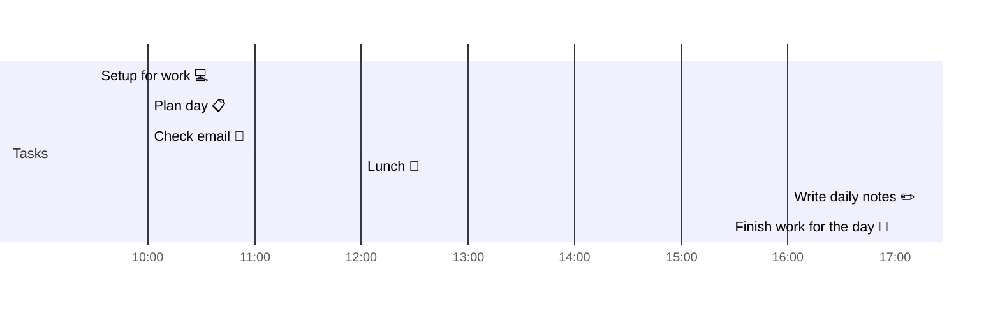

# 📆 2021-04-07

Before planning a day, reflect on the [[PhD Timeline]]. Does what you [[want to do]] match what you [[need to do]]?

## PhD Timeline

![[PhD Timeline]]

## Day Planner


- [x] 09:30 Setup for work 💻
- [x] 10:00 Plan day 📋
- [x] 10:00 Check email 📧
- [x] 12:00 Lunch 🍙
- [x] 16:00 Write daily notes ✏️
- [x] 17:00 Finish work for the day 🎉

## Tasks

### Due Today

```query
line:("⬜/🧨 | [[2021-04-07]]") -path:README -path:Kanban -path:journal -path:templates
```

### Done Today

```query
line:("⬜/✨ | [[2021-04-07]]") -path:README -path:Kanban -path:journal -path:templates
```


### Upcoming

```query
line:(⬜/🧨 -2021-04-07) -path:README -path:Kanban -path:journal -path:templates
```

---

tags: [[Journal]]  
prev: [[2021-04-06]]  
next: [[2021-04-08]]  
scratch: [[2021-04-07 Scratch|2021-04-07 Scratch]]