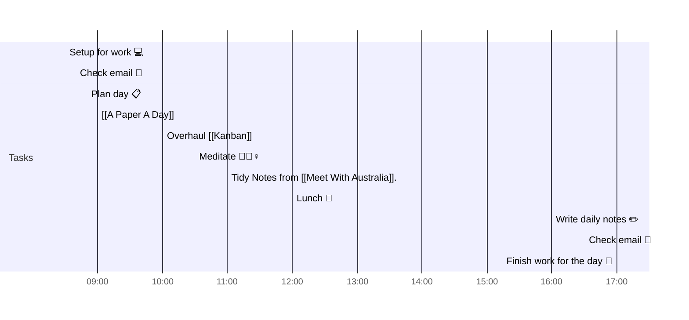

# 📆 2021-05-07

Before planning a day, reflect on the [[PhD Timeline]]. Does what you [[want to do]] match what you [[need to do]]?

## PhD Timeline

![[PhD Timeline]]

## Day Planner

- [x] 08:30 Setup for work 💻
- [x] 08:40 Check email 📧
- [x] 08:50 Plan day 📋
- [x] 09:00 [[A Paper A Day]]
- [x] 10:00 Overhaul [[Kanban]]
- [ ] 10:30 Meditate 🧘🏻‍♀️
- [ ] 11:00 Tidy Notes from [[Meet With Australia]].
- [ ] 12:00 Lunch 🍙
- [ ] 16:00 Write daily notes ✏️
- [ ] 16:30 Check email 📧
- [ ] 17:00 Finish work for the day 🎉

## Tasks

![[Kanban]]

---

prev: [[2021-05-06]]  
next: [[2021-05-08]]  