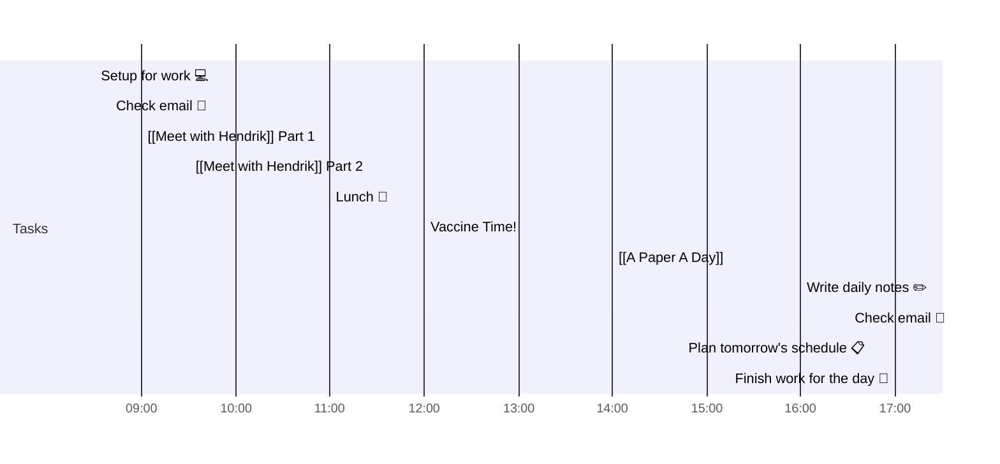

# 📆 2021-05-11

Before planning a day, reflect on the [[PhD Timeline]]. Does what you [[want to do]] match what you [[need to do]]?

## PhD Timeline

![[PhD Timeline]]

## Day Planner

- [x] 08:30 Setup for work 💻
- [x] 08:40 Check email 📧
- [x] 09:00 [[Meet with Hendrik]] Part 1
- [x] 09:30 [[Meet with Hendrik]] Part 2
- [ ] 11:00 Lunch 🍙
- [ ] 12:00 Vaccine Time!
- [ ] 14:00 [[A Paper A Day]]
- [ ] 16:00 Write daily notes ✏️
- [ ] 16:30 Check email 📧
- [ ] 16:45 Plan tomorrow's schedule 📋
- [ ] 17:00 Finish work for the day 🎉

## Tasks

![[Kanban]]

---

prev: [[2021-05-10]]  
next: [[2021-05-12]]  