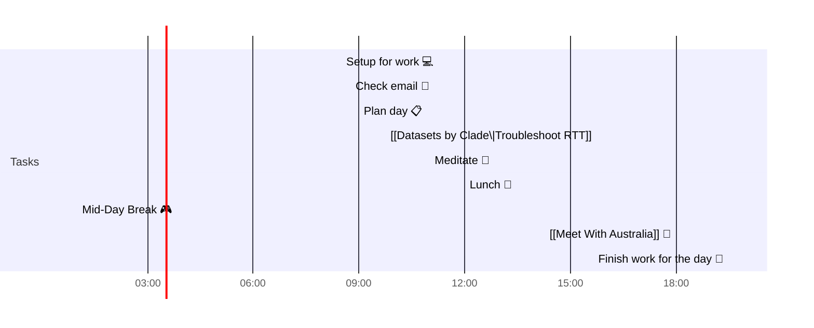

# 📆 2021-05-13

Before planning a day, reflect on the [[PhD Timeline]]. Does what you [[want to do]] match what you [[need to do]]?

## PhD Timeline

![[PhD Timeline]]

## Day Planner

- [x] 08:30 Setup for work 💻
- [x] 08:45 Check email 📧
- [x] 09:00 Plan day 📋
- [x] 09:45 [[Clade Datasets\|Troubleshoot RTT]]
- [x] 11:00 Meditate 🧘
- [x] 12:00 Lunch 🍙
- [x] 01:00 Mid-Day Break 🎮
- [x] 18:00 [[Meet With Australia]] 👤
- [x] 19:30 Finish work for the day 🎉

## Tasks

![[Kanban]]

---

prev: [[2021-05-13]]  
next: [[2021-05-13]]  