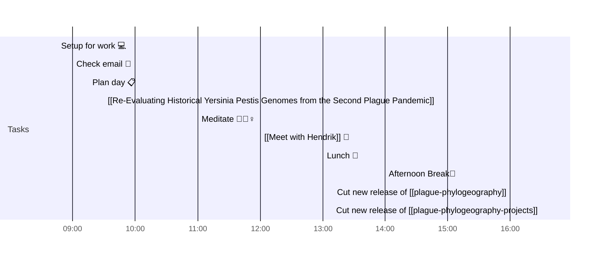

# 📆 2021-05-14

Before planning a day, reflect on the [[PhD Timeline]]. Does what you [[want to do]] match what you [[need to do]]?

## PhD Timeline

![[PhD Timeline]]

## Day Planner

- [x] 08:45 Setup for work 💻
- [x] 09:00 Check email 📧
- [x] 09:15 Plan day 📋
- [ ] 09:30 [[Re-Evaluating Historical Yersinia Pestis Genomes from the Second Plague Pandemic]]
- [ ] 11:00 Meditate 🧘🏻‍♀️
- [ ] 12:00 [[Meet with Hendrik]] 👤
- [ ] 13:00 Lunch 🍙
- [ ] 14:00 Afternoon Break🍩
- [ ] 16:00 Cut new release of [[plague-phylogeography]]
- [ ] 16:30 Cut new release of [[plague-phylogeography-projects]]

## Tasks

![[Kanban]]

---

prev: [[2021-05-13]]  
next: [[2021-05-15]]  