# 📆 2021-05-19

Before planning a day, reflect on the [[PhD Timeline]]. Does what you [[want to do]] match what you [[need to do]]?

## PhD Timeline

![[PhD Timeline]]

## Day Planner

```mermaid
gantt
    dateFormat  HH-mm
    axisFormat %H:%M
    %% Current Time: 3:28:25 PM
    section Tasks
    Setup for work 💻     :10-00, 30mm
    Check email 📧     :10-30, 60mm
    [[NCBImeta Release v0.8.1]]     :11-30, 30mm
    [[NCBImeta Troubleshoting for Fabio]]     :12-00, 30mm
    Plan day 📋     :12-30, 30mm
    Lunch 🍙     :13-00, 180mm
    Write daily notes ✏️     :16-00, 30mm
    Check email 📧     :16-30, 30mm
    Finish work for the day 🎉     :17-00, 0mm
    section Breaks

```

- [x] 10:00 Setup for work 💻
- [x] 10:30 Check email 📧
- [x] 11:30 [[NCBImeta Release v0.8.1]]
- [x] 12:00 [[NCBImeta Troubleshoting for Fabio]]
- [x] 12:30 Plan day 📋
- [ ] 13:00 Lunch 🍙
- [ ] 16:00 Write daily notes ✏️
- [ ] 16:30 Check email 📧
- [ ] 17:00 Finish work for the day 🎉

## Tasks

![[Kanban]]

---

prev: [[2021-05-19]]  
next: [[2021-05-19]]  