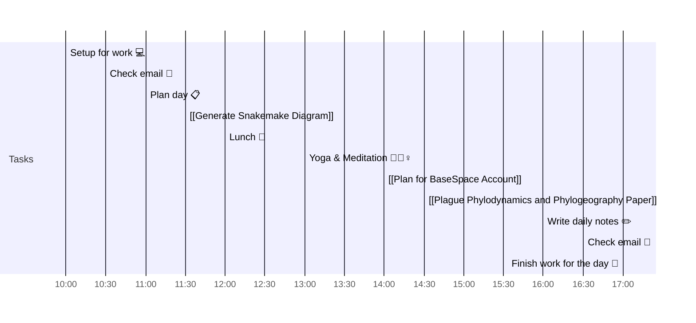

# 📆 2021-05-21

Before planning a day, reflect on the [[PhD Timeline]]. Does what you [[want to do]] match what you [[need to do]]?

## PhD Timeline

![[PhD Timeline]]

## Day Planner

- [x] 10:00 Setup for work 💻
- [x] 10:30 Check email 📧
- [x] 11:00 Plan day 📋
- [x] 11:30 [[Generate Snakemake Diagram]]
- [x] 12:00 Lunch 🍙
- [x] 13:00 Yoga & Meditation 🧘🏻‍♀️
- [x] 14:00 [[Plan for BaseSpace Account]]
- [x] 14:30 [[Plague Phylodynamics and Phylogeography Paper]]
- [x] 16:00 Write daily notes ✏️
- [x] 16:30 Check email 📧
- [x] 17:00 Finish work for the day 🎉

## Tasks

![[Kanban]]

---

prev: [[2021-05-20]]  
next: [[2021-05-22]]  