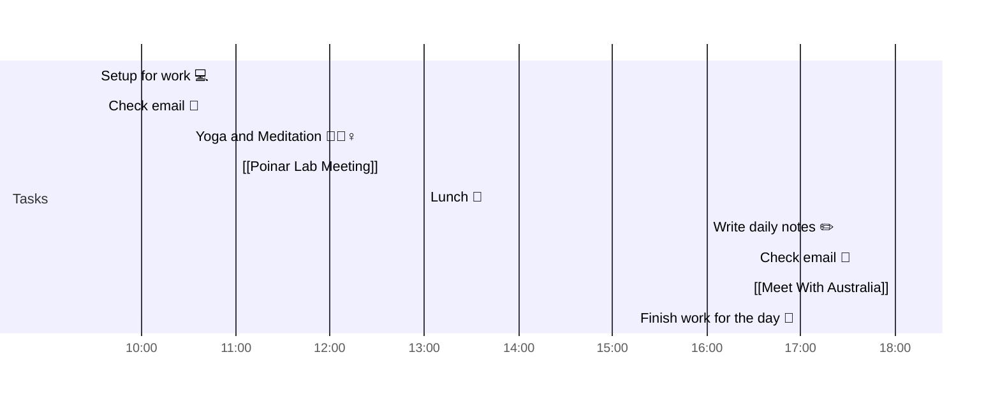

# 📆 2021-05-25

Before planning a day, reflect on the [[PhD Timeline]]. Does what you [[want to do]] match what you [[need to do]]?

## PhD Timeline

![[PhD Timeline]]

## Day Planner

- [x] 09:30 Setup for work 💻
- [x] 09:35 Check email 📧
- [x] 10:30 Yoga and Meditation 🧘🏻‍♀️
- [x] 11:00 [[Poinar Lab Meeting]]
- [x] 13:00 Lunch 🍙
- [x] 16:00 Write daily notes ✏️
- [ ] 16:30 Check email 📧
- [ ] 18:00 [[Meet With Australia]]
- [x] 17:00 Finish work for the day 🎉

## Tasks

![[Kanban]]

---

prev: [[2021-05-21]]  
next: [[2021-05-26]]  