# 📆 2021-05-31

Before planning a day, reflect on the [[PhD Timeline]]. Does what you [[want to do]] match what you [[need to do]]?

## PhD Timeline

![[PhD Timeline]]

## Day Planner

```mermaid
gantt
    dateFormat  HH-mm
    axisFormat %H:%M
    %% Current Time: 11:57:07 AM
    section Tasks
    Setup for work 💻     :08-30, 10mm
    Check email 📧     :08-40, 10mm
    Plan day 📋     :08-50, 10mm
    [[A Paper A Day]]     :09-00, 60mm
    Meditate 🧘🏻‍♀️     :10-00, 120mm
    Lunch 🍙     :12-00, 240mm
    Write daily notes ✏️     :16-00, 30mm
    Check email 📧     :16-30, 30mm
    Finish work for the day 🎉     :17-00, 0mm
    section Breaks

```

- [x] 08:30 Setup for work 💻
- [x] 08:40 Check email 📧
- [x] 08:50 Plan day 📋
- [x] 09:00 [[A Paper A Day]]
- [ ] 10:00 Meditate 🧘🏻‍♀️
- [ ] 12:00 Lunch 🍙
- [ ] 16:00 Write daily notes ✏️
- [ ] 16:30 Check email 📧
- [ ] 17:00 Finish work for the day 🎉

## Tasks

![[Kanban]]

---

prev: [[2021-05-31]]  
next: [[2021-05-31]]  