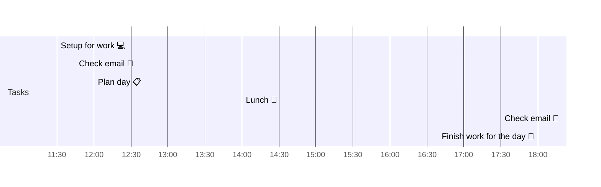

# 📆 2021-06-02

Before planning a day, reflect on the [[PhD Timeline]]. Does what you [[want to do]] match what you [[need to do]]?

## PhD Timeline

![[PhD Timeline]]

## Day Planner

- [x] 11:30 Setup for work 💻
- [x] 11:45 Check email 📧
- [x] 12:00 Plan day 📋
- [ ] 
- [x] 14:00 Lunch 🍙
- [x] 17:30 Check email 📧
- [x] 18:00 Finish work for the day 🎉

## Tasks

![[Kanban]]

---

prev: [[2021-06-01]]  
next: [[2021-06-03]]  