# 📆 2021-07-14

Before planning a day, reflect on the [[PhD Timeline]]. Does what you [[want to do]] match what you [[need to do]]?

## PhD Timeline

![[PhD Timeline]]

## Day Planner

```mermaid
gantt
    dateFormat  HH-mm
    axisFormat %H:%M
    %% Current Time: 11:27:46 PM
    section Tasks
    Setup for work 💻     :10-00, 15mm
    Check email 📧     :10-15, 15mm
    Work on [[Plague Denmark Paper]]     :10-30, 150mm
    Lunch 🍙     :13-00, -150mm
    Work on [[Plague Denmark Paper]]     :10-30, 300mm
    Coffee Break! ☕     :15-30, 150mm
    Check email 📧     :18-00, 30mm
    Finish work for the day 🎉- [ ]     :18-30, 0mm
    section Breaks

```

- [x] 10:00 Setup for work 💻
- [x] 10:15 Check email 📧
- [x] 10:30 Work on [[Plague Denmark Paper]]
- [x] 13:00 Lunch 🍙
- [x] 10:30 Work on [[Plague Denmark Paper]]
- [x] 15:30 Coffee Break! ☕
- [x] 18:00 Check email 📧
- [x] 18:30 Finish work for the day 🎉- [ ]

## Tasks

![[Kanban]]

---

prev: [[2021-07-07]]  
next: [[2021-07-15]]  