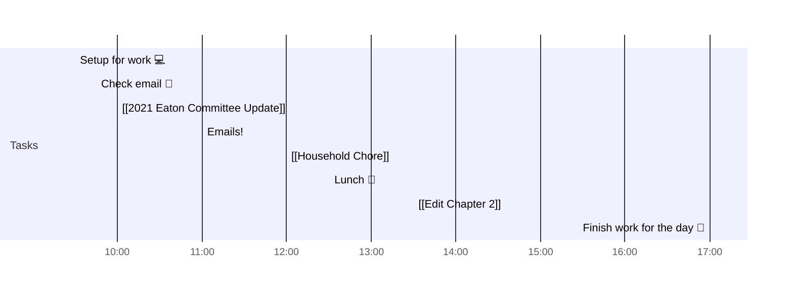

# 📆 2021-08-11

Before planning a day, reflect on the [[PhD Timeline]]. Does what you [[want to do]] match what you [[need to do]]?

## PhD Timeline

![[PhD Timeline]]

## Day Planner

- [x] 09:30 Setup for work 💻
- [x] 09:45 Check email 📧
- [x] 10:00 [[2021 Eaton Committee Update]]
- [x] 11:00 Emails!
- [x] 12:00 [[Household Chore]]
- [x] 12:30 Lunch 🍙
- [x] 13:30 [[Edit Chapter 2]]
- [x] 17:00 Finish work for the day 🎉

## Tasks

![[Kanban]]

---

prev: [[2021-08-10]]  
next: [[2021-08-12]]  