# 📆 2021-08-11

Before planning a day, reflect on the [[PhD Timeline]]. Does what you [[want to do]] match what you [[need to do]]?

## PhD Timeline

![[PhD Timeline]]

## Day Planner

```mermaid
gantt
    dateFormat  HH-mm
    axisFormat %H:%M
    %% Current Time: 12:33:41 PM
    section Tasks
    Setup for work 💻     :09-30, 15mm
    Check email 📧     :09-45, 15mm
    [[2021 Eaton Committee Update]]     :10-00, 60mm
    Emails!     :11-00, 60mm
    Lunch 🍙     :12-00, 60mm
    [[Edit Chapter 2]]     :13-00, 240mm
    Finish work for the day 🎉     :17-00, 0mm
    section Breaks

```

- [x] 09:30 Setup for work 💻
- [x] 09:45 Check email 📧
- [x] 10:00 [[2021 Eaton Committee Update]]
- [x] 11:00 Emails!
- [ ] 12:00 Lunch 🍙
- [ ] 13:00 [[Edit Chapter 2]]
- [ ] 17:00 Finish work for the day 🎉

## Tasks

![[Kanban]]

---

prev: [[2021-08-10]]  
next: [[2021-08-11]]  