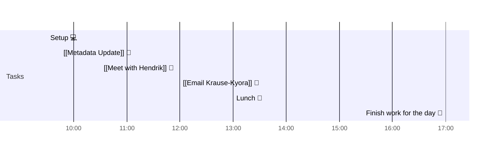

# 📆 2021-08-12

Before planning a day, reflect on the [[PhD Timeline]]. Does what you [[want to do]] match what you [[need to do]]?

## PhD Timeline

![[PhD Timeline]]

## Day Planner

- [x] 09:30 Setup 💻
- [x] 09:45 [[Metadata Update]] 🔗
- [x] 10:30 [[Meet with Hendrik]] 👤
- [x] 12:00 [[Email Krause-Kyora]] 📧
- [x] 13:00 Lunch 🍙
- [x] 17:00 Finish work for the day 🎉

## Tasks

![[Kanban]]

---

prev: [[2021-08-11]]  
next: [[2021-08-13]]  