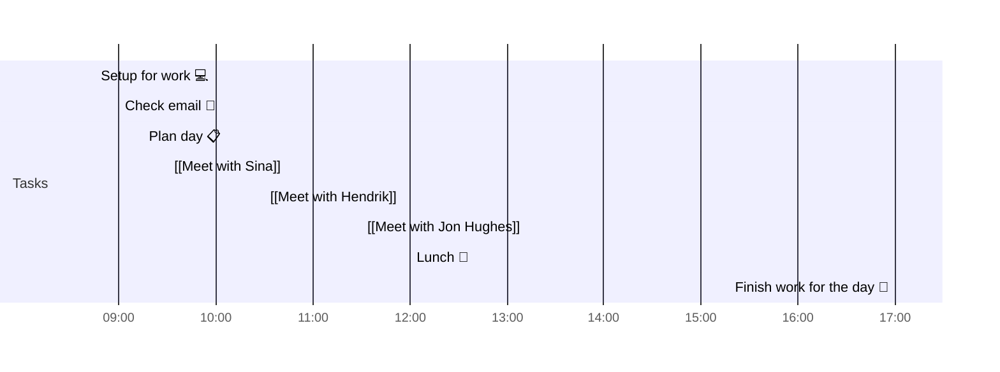

# 📆 2021-10-14

## Day Planner

- [x] 08:45 Setup for work 💻
- [x] 09:00 Check email 📧
- [x] 09:15 Plan day 📋
- [x] 09:30 [[Meet with Sina]]
- [x] 10:30 [[Meet with Hendrik]]
- [x] 11:30 [[Meet with Jon Hughes]]
- [x] 12:00 Lunch 🍙
- [x] 17:00 Finish work for the day 🎉

## Tasks

![[Kanban]]

---

prev: [[2021-10-14]]  
next: [[2021-10-14]]  