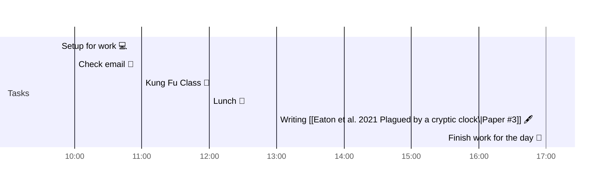

# 📆 2021-11-17

## Day Planner

- [x] 09:45 Setup for work 💻
- [x] 10:00 Check email 📧
- [x] 11:00 Kung Fu Class 🥋
- [x] 12:00 Lunch 🍙
- [x] 13:00 Writing [[Eaton et al. 2021 Plagued by a cryptic clock\|Paper #3]] 🖋
- [x] 17:00 Finish work for the day 🎉

## Tasks

![[Kanban]]

---

prev: [[2021-11-17]]  
next: [[2021-11-17]]  