## Introduction 

### Concept 1. Disease Exposure

- How do we contract an infectious disease?
- How do we spread it?
- Why does this vary across time and space?

### Concept 2. Disease Experience

- Are the symptoms mild?
- Does it become endemic and part of our everyday life?
- Is there catastrophic mortality?
- Does it radically change society?

### Zoonoses

- Diseases that spread from non-human animals to humans.
- Enigmatic epidemiology that is often poorly understood.
	- COVID-19
	- Malaria
	- Influenza
	- Brucellosis
	- Lyme Disease
	- Plague

### Plague

1. **Prolific presence in human populations, at least since the Bronze Age (~3000 YBP).**

![Geographic distribution of human plague cases (1772 - 2014) [@xu2019HistoricalGenomicData]. ](xu2019HistoricalGenomicData_fig1.jpg){#fig:xu_2019}

### Plague

2. **Unnerving virulence and mortality.**
	- The medieval Black Death (1346-1353) killed more than 50% of Europe's population. [@benedictow2021CompleteHistoryBlack].
	- Untreated pneumonic plague has a case fatality rate of nearly 100% [@prentice2007Plague; @salam2020DeathsAssociatedPneumonic].

3. **It keeps coming back!**
	- First Pandemic (6th - 8th Century CE)
	- Second Pandemic (14th - 19th Century CE)
	- Third Pandemic (19th - 20th Century CE)

4. **A cryptic clock.**
	- Debated whether molecular clock techniques can produce informative rates and dates.
	- An extremely slow evolutionary rate coupled with extreme rate variation.

### Objectives

1. Is there any way to **estimate robust rates and dates** for _Y. pestis_?
2.  Do I have **anything new to say** about the history and epidemiology of plague?

## Materials and Methods

### Materials and Methods

<aside class="notes">
- Bayesian (BEAST) analysis was inconclusive (strict or relaxed). 
- Poor sampling, lack of convergence, low ESS. 
- Why? Too much rate variation! 
- Reducing the number of samples, reducing tip date uncertainty, fixing the tree topology. 
- Rates and dates are not informative! 
- Pictures of Sebastian and Leo. 
</aside>

1. **601 publicly available _Y. pestis_ genomes.**
	- 540 modern (89.9%): 20th to 21st century CE.
	- 61 ancient (10.1%): 3rd millenium BCE to 18th century CE.
2. **Multiple alignment of the core genome.**
3. **Estimated a maximum-likelihood phylogeny.**
4. **Bayesian Evaluation of Temporal Signal (BETS).**
	- Strict Clock
	- Relaxed Clock
	- Global Clock
	- Population Clocks [@cui2013HistoricalVariationsMutation]
5. **Estimated rates and dates for populations with temporal signal.**

### Population Structure

 

{#fig:divtree}

### Molecular Clocks

 

- The global clock analysis (all samples) was VERY unstable.

{#fig:rtt height=400px}

### Molecular Clocks

- Tried reducing sources of rate variation:
	- Decreasing the number of samples.
	- Fixing tip dates.
	- Fixing tree topology.
	
> The global diversity of _Y. pestis_ is poorly modeled by a single molecular clock.

- Population clocks **recovered temporal signal** in 9 out of 12 populations.
- For all populations, the relaxed clock outerperformed the strict clock.

## The Phylodynamic Threshold

<aside class="notes">
- SARS-CoV-2: Is a virus, thus fast-evolving, threshold reached in 2 months of the start of the pandemic.
</aside>

> _"The point in time at which sufficient molecular evolutionary change has accumulated in available genome samples to obtain robust phylodynamic estimates."_ 
>  
> _"Before the phylodynamic threshold is reached, genomic variation is so low that even large amounts of genome sequences may be insufficient to estimate the virus’s evolutionary rate and the time scale of an outbreak."_ 
>  
> - Duchene et al. (2020) [@duchene2020TemporalSignalPhylodynamic].

### Rates of Evolutionary Change {data-transition="none"}

- _Y. pestis_ has one of the slowest substitution rates among bacterial pathogens [@duchene2016GenomescaleRatesEvolutionary].
- _Y. pestis_ has substantial rate variation [@cui2013HistoricalVariationsMutation].

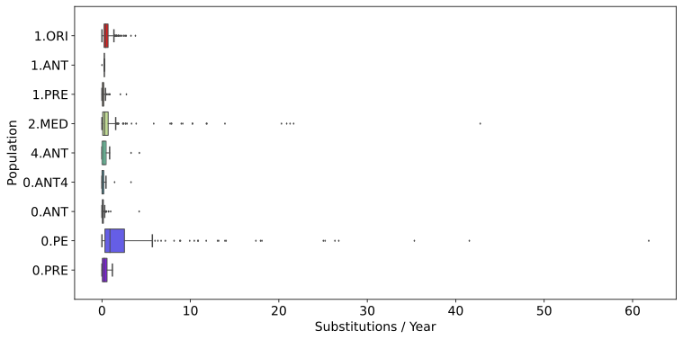{#fig:rates_mcc_tree height=400px}

### Rates of Evolutionary Change {data-transition="none"}

- _Y. pestis_ has one of the slowest substitution rates among bacterial pathogens [@duchene2016GenomescaleRatesEvolutionary].
- _Y. pestis_ has substantial rate variation [@cui2013HistoricalVariationsMutation].

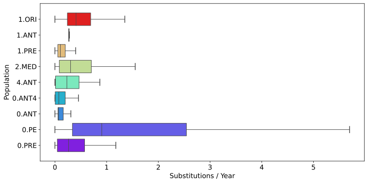{#fig:rates_mcc_tree_no_outliers height=400px}

### Why Do We Care?

- Rates and dates of short-term events will be meaningless.
	- Ex. Epidemics, recently emerged populations.
 

> But what does "short-term" mean?

### No Temporal Signal

<aside class="notes">
- 3 populations had insufficient phylogenetic and temporal information. 
</aside>

- Three populations have no temporal signal (Figure @fig:no_temporal_signal).
- Shortest sampling time frames.
- Node density is highest close to the root.

> These populations have rates and dates that are **non-informative**. 
> The **phylodynamic threshold** of _Y. pestis_ is greater than 50 years.  
> Comparisons over shorter time scales will have **limited resolving power**.

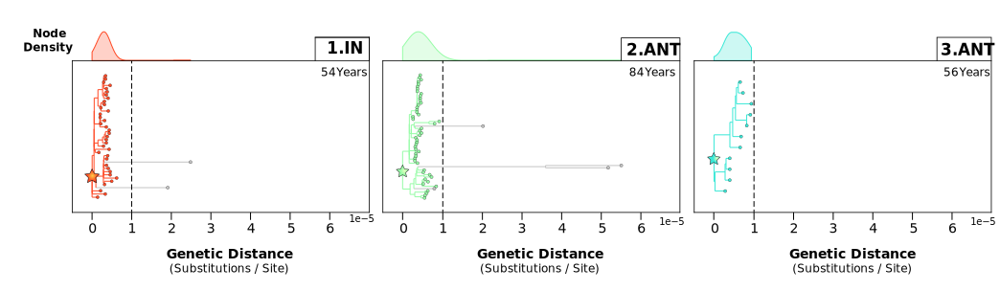{#fig:no_temporal_signal}

### Epidemic Analysis

<aside class="notes">
> **Solution:** Other genetic markers?
</aside>

> Intra-epidemic diversity is poorly resolved by a core genome SNP phylogeny

- Black Death (1346 - 1353) _Y. pestis_ isolates are indistinguishable clones [@spyrou2016HistoricalPestisGenomes].

 ![Spread map of the Black Death [@benedictow2004BlackDeath13461353].](Map Black Death.png){#fig:map_black_death height=300px}

### The Third Pandemic

<aside class="notes">
- **Solution:** Increased sampling of long internal branches.
</aside>

- The events leading up to the Third Pandemic (1.ORI) are highly uncertain. 
- When and how, did the epidemiology of plague change from localized epidemics in Yunnan Province, China to a global pandemic?

 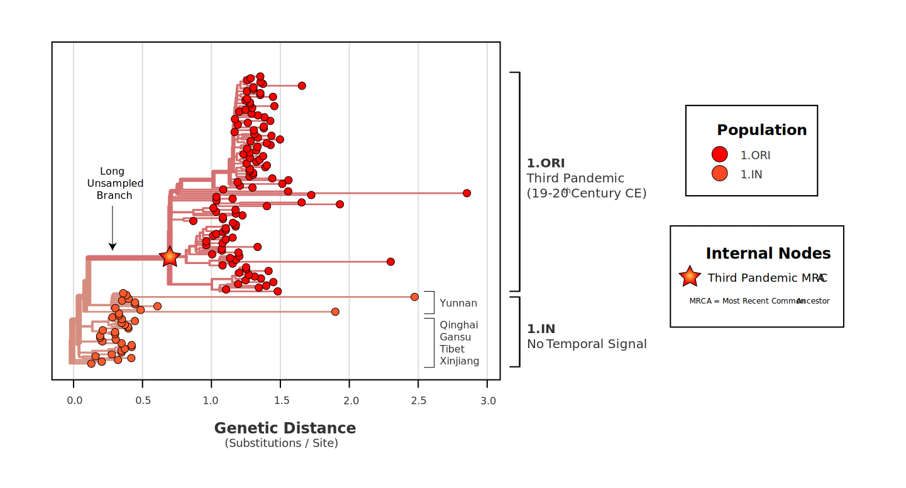{#fig:divtree_1.IN_1.ORI height=350px}
 
## Ancient DNA

### Temporal Signal With Ancient DNA

<aside class="notes">
- Second Pandemic (1.PRE) starts with a polytomy, root position is incorrectly inferred.
</aside>
	

All (3) ancient _Y. pestis_ populations had temporal signal:

- 1.PRE | Second Pandemic (14th - 19 th century CE)
- 0.ANT4 | First Pandemic (6th - 8 th century CE)
- 0.PRE | Bronze Age (3rd - 1st Millennia BCE)

 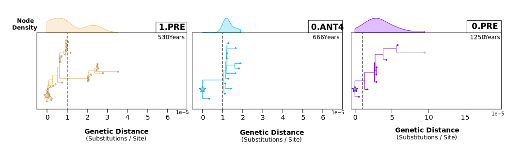{#fig:temporal_signal_ancient}
 
### What Can We Learn?

<aside class="notes">
- Example: What if we tried to reconstruct COVID pandemic just from European data? 2020, Italy.
</aside>

- Informative rates and dates can be obtained when **the sampling time frame is >500 years**.
- Node age **uncertainty can be 100+ years** (95% HPD).
- Genetic evidence suggests that the **plague pandemics may have earlier origins**.
- Most evidence of historical plague comes from European sources.
- New scholarship of non-European sources is rewriting these narratives [@varlik2020PlagueThatNever].

  
 
| Population |      Event      | tMRCA (Lower) | tMRCA (Upper) | Historical Start |
|:----------:|:---------------:|:------------:|:-------------:|:----------------:|
|   1.PRE    | Second Pandemic |     1214     |     1315      |       1346       |
|   0.ANT4   | First Pandemic  |     272      |      466      |       541        |
|   0.PRE    |   Bronze Age    |    -3098     |     -2786     |        --        |

Table: Node dating of key historical plague events. {#tbl:node_dating_ancient}
 
## Modern DNA

### Temporal Signal With Modern DNA

<aside class="notes">
- Uncertainty always increases further back in time, but for 2.MED uncertainty gets really big really fast.
- Insert time trees here?
- High uncertainty in the root position, leading to large confidence intervals.
- Use the branching order in the maximum likelihood phylogeny to help root it?
- [@morelli2010YersiniaPestisGenome] [@cui2013HistoricalVariationsMutation] This Study
- 3rd pandemic date originally 1894, pushed back to 1855. Some argue as early as 1722.
</aside>

- Two modern populations had temporal signal, despite having no ancient DNA calibrations.
	- The Third Pandemic (1.ORI), global.
	- *Medievalis* (2.MED), Asia.
- Have high epidemiological significance:
	- High mortality epidemics.
	- Extensive and rapid geographic spread.

 {#fig:temporal_signal_modern}

### Temporal Signal With Modern DNA

- As more data becomes available, the **node dates are becoming younger** [@pisarenko2021YersiniaPestisStrains].

 

|  Population   |          Name          | Study |       Samples       |        tMRCA (Lower)         |        tMRCA (Upper)         |
|:-------------:|:----------------------:|:-----:|:-------------------:|:----------------------------:|:----------------------------:|
|  1.ORI  |  Third Pandemic  |  TBD  | 6 17 93 117 | -381 1735 1742 1806 | 1738 1863 1842 1901 | 
|  2.MED  |   *Medievalis*   |  TBD  | 2 25 68 116 | -638 1450 1298 1560 | 1715 1750 1582 1845 |
	
Table: Node dating of modern _Yersinia pestis_ populations. {#tbl:node_dating_modern}

### Timeline of The Third Pandemic

<aside class="notes">
	 {height=350px}
</aside>

	
- We estimate that the Third Pandemic (1.ORI) **emerged between 1806 and 1901 (1885)**.
- This **aligns with historical evidence** from Chinese epidemiologists [@xu2014WetClimateTransportation] [@tan2002AtlasPlagueIts].
- 1772 - 1800:  Human plague cases are isolated to Yunnan, China.
- 1880 - 1900: Plague spreads to the south-eastern provinces.
- 1894: Plague spreads worldwide out of Hong Kong.

|                                                                |                                                                    | 
|:--------------------------------------------------------------:|:------------------------------------------------------------------:|
| {width=500px} | 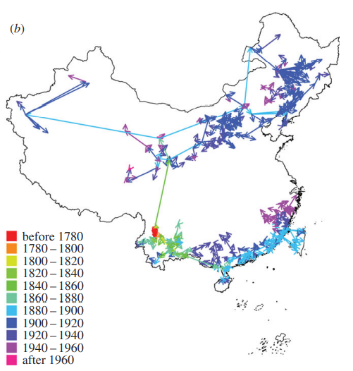{width=300px} |

### *Medievalis*

- We estimate that *Medievalis* (2.MED) **emerged between 1560 and 1845 (1796)**.
- This **aligns with historical evidence** [@kahan1979SocialAspectsPlague; @hashemishahraki2016PlagueIranIts; @eroshenko2019CirculationYersiniaPestis].
- Late 1798: Human plague cases are observed in the Caucasus.
- 1800s: Plague cases throughout the Caspian Sea region.
- 1900s-2000s: Widespread dispersal across Asia.

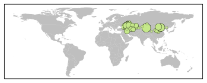

### Whodunnit?

- *Medievalis* (2.MED), *Pestoides* (0.PE), or the Second Pandemic (1.PRE)?

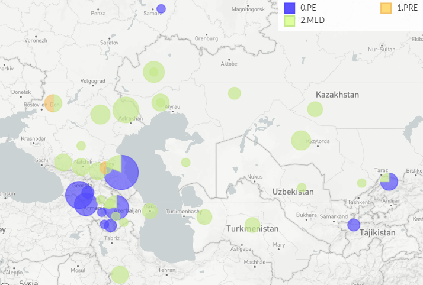{height=400px}

## Good Temporal Signal ≠ Good Node Dates

### Node Date Conflicts

- Several populations have conflicting dates for their tMRCA.
- These populations are not monophyletic.
- Ex. *Antiqua* (0.ANT) is ancestral to the First Pandemic (0.ANT4).
- The tMRCA of *Antiqua* (0.ANT) incorrectly post-dates the First Pandemic (0.ANT4).

 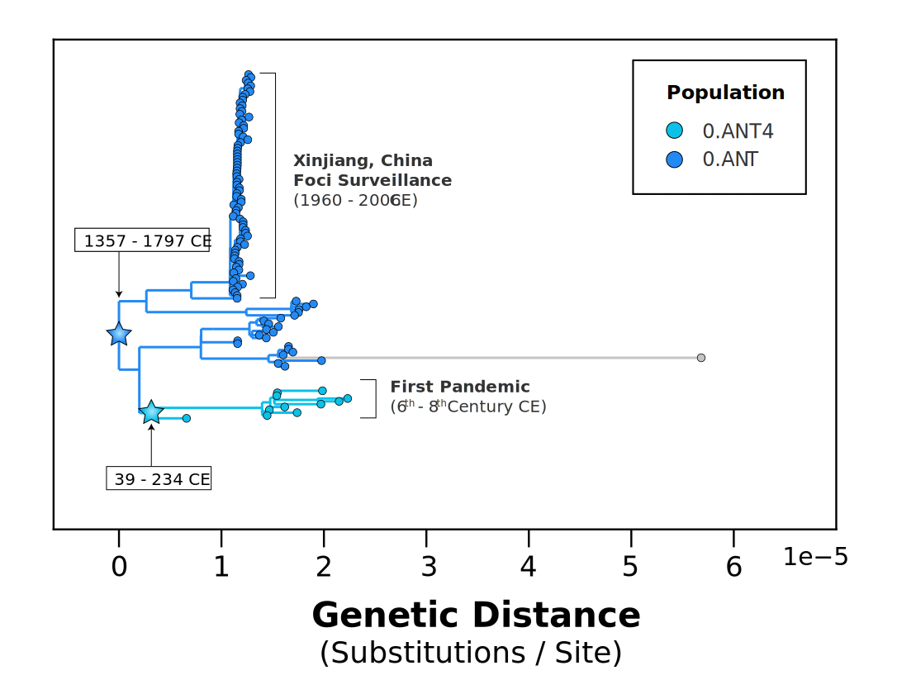{#fig:date_conflict height=400px}

### Node Date Conflicts

- Node density is low close to the root.
- Node dates are underestimated (too young). Can be off by a 1000 years!

> Insufficient sample sizes (1.ANT). 
> Insufficient geographic sampling (0.ANT). 
> Extensive rate variation (0.PE) with no ancient DNA calibrations.

 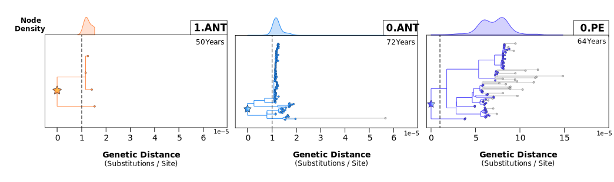{#fig:suspicious_dates}

### Arrival of Plague in Africa

<aside class="notes">
- Plague in Africa is really important for public health research = high interest.
- But the genetic evidence is very flimsy for estimating a continental tMRCA.
</aside>

- Africa accounts for more than 90% of all human plague cases [@munyenyiwa2019PlagueZimbabwe1974] .
- But only 1.5% of _Y. pestis_ genomes are from Africa.
- Heavily debated when plague first arrived in Central and East Africa (1.ANT).

 

|  Population   |           Name            | Study |     Samples     |     tMRCA (Lower)     |    tMRCA (Upper)     |
|:-------------:|:-------------------------:|:-----:|:---------------:|:---------------------:|:--------------------:|
|  1.ANT  |  African *Antiqua*  |  TBD  | 2 2 4  | -4964 1377 1655 | 1322 1650 1835 |
	
  

> Genetic dates for the tMRCA of 1.ANT in Africa are non-informative! 
> They should not be used as a basis for historical or archaeological interpretation [@green2018PuttingAfricaBlack].

## Conclusions

### Methodology

> **Poor performance of a global molecular clock.** 
> - Intensive global sampling  → More genetic diversity → More rate variation. 
> - Partitioning the data by population stabilizes clock estimates.

> **The phylodynamic threshold is very important!** 
> - A short sampling time frame (<50 years) led to non-informative rates and dates. 
> - Longer sampling time frames (>90 years) led to detectable temporal signal.

> **Temporal signal does not mean _all_ dates will be informative.** 
> - Insufficient sampling produces conflicting node dates. 
> - Can be detected in trees with few nodes close to the root.

### Plague History

> The tMRCAs of **ancient plague pandemics are older** than previously thought. 
> - Challenges Eurocentric views of  plague history.

> The tMRCAs of **modern plague are younger** than previously thought. 
> - Aligns with historical evidence.

## References

## Supplementary Slides

### Branch Length Distribution

### Phylogeography

<aside class="notes">
- A lot of uncertainty about the geographic origins and spread of the Second Pandemic (genetic data).
- Short sampling time frame (ex. Black Death), really hard to get the root position correct without prior information. Also Germany, Poland, Lithuania.
- Sparse geographic sampling. 500 years, 40 genomes, 11 countries.
- To reconstruct spread (point migrations), need to pin Yp location to single points (country).
- Intra-continental spread reconstructions have no low confidence.
- Companion is the phylogeographic threshold BETS test with geography instead of dates? Randomize the countries.
- BETS test, all dates set to contemporaneous (or randomized)?
</aside>

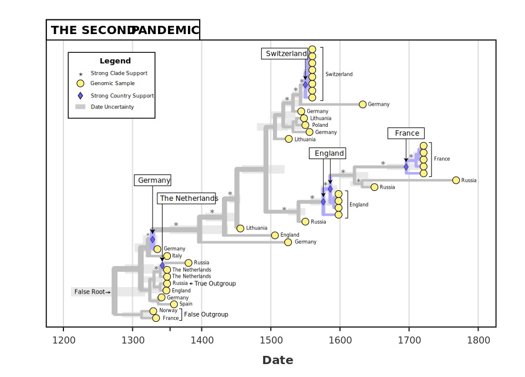{#fig:1.PRE_timetree height=500px}
 
### Phylogeography
 
 

 
 > Inter-country geogrpahy....
 
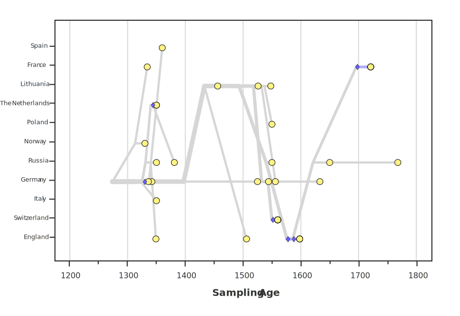{#fig:1.PRE_scatter height=500px}

### Notes

- Confidence Interval Distribution