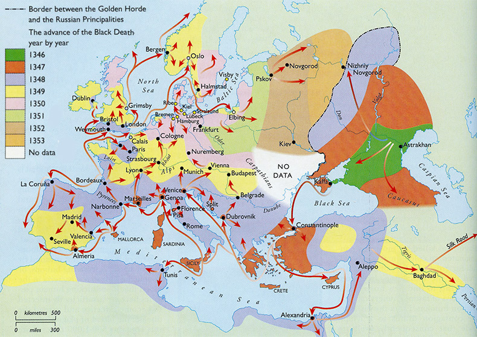

## Introduction 

### Disease Exposure and Disease Experience

### Zoonoses

### Plague

### {data-transition="none"}

{#fig:test}

### {data-transition="none"}

<aside class="notes">
- This is a timeline of plague based on historical evidence. 
- White: Periods with written evidence of plague. 
- Earliest textual evidence of plague in Late Antiquity. 3 historical catalogues document a pandemic from the 6th - 8th century. Dubbed the First Pandemic. 
- Plague reappears in the historical record for a second time, 14th-19th century, Second Pandemic. 
- Finally, appears for a third time, 19th-20th century
</aside>

{#fig:plague_timeline_blank height=500px}

### {data-transition="none"}

{#fig:plague_timeline_modern height=500px}

### {data-transition="none"}

{#fig:plague_timeline_ancient height=500px}

### Objectives

## _Y. pestis_  Population Structure

### Population Structure

 

{#fig:divtree}

### Global Molecular Clock

<aside class="notes">
- Bayesian (BEAST) analysis was inconclusive (strict or relaxed). 
- Poor sampling, lack of convergence, low ESS. 
- Why? Too much rate variation! 
- Reducing the number of samples, reducing tip date uncertainty, fixing the tree topology. 
- Rates and dates are not informative! 
- Pictures of Sebastian and Leo. 
</aside>

> The global diversity of _Y. pestis_ is poorly modeled by a single molecular clock.

{#fig:rtt height=400px}

### Population Molecular Clocks

> Population clocks recover temporal signal in 9 of 12 populations. 

- Clock parameters: ESS scores > 200
- Relaxed clock (Uncorrelated lognormal) outperforms strict clocks.

## Observation ?: Temporal Signal With aDNA

### Temporal Signal With aDNA

<aside class="notes">
- Second Pandemic (1.PRE) starts with a polytomy, root position is incorrectly inferred.
</aside>
	

- All (3) ancient _Y. pestis_ populations had temporal signal.
- Bronze Age (0.PRE), First Pandemic (0.ANT4), Second Pandemic (1.PRE).

### Phylogeography

{#fig:1.PRE_timetree width=100%}

## Observation ?: Temporal Signal Without aDNA

### Temporal Signal Without aDNA

<aside class="notes">
- Uncertainty always increases further back in time, but for 2.MED uncertainty gets really big really fast.
- Insert time trees here?
- High uncertainty in the root position, leading to large confidence intervals.
- 1.ORI: 1806 - 1901
- 2.MED: 1443 - 1878
- Use the branching order in the maximum likelihood phylogeny to help root it?
- [@morelli2010YersiniaPestisGenome] [@cui2013HistoricalVariationsMutation] This Study
</aside>

- 2 modern populations had temporal signal, despite having no ancient DNA calibrations.
- The Third Pandemic (1.ORI)
- *Medievalis* (2.MED), once thought to be the cause of the Black Death.

 

| Population |      Name      |    tMRCA (Lower)     |    tMRCA (Upper)     | Study |
|:----------:|:--------------:|:--------------------:|:--------------------:|:-----:|
|   1.ORI    | Third Pandemic | -381 1735 1806 | 1738 1863 1901 |  TBD  |
|   2.MED    |  *Medievalis*  | -638 1450 1560 | 1715 1750 1845 |  TBD  | 
	
Table: Table test! {#tbl:test}

## Observation ?:  No Temporal Signal

### Observation ?: No Temporal Signal

<aside class="notes">
- 3 populations had insufficient phylogenetic and temporal information. 
</aside>

- Three populations have no temporal signal (Figure @fig:no_temporal_signal).
- Shortest sampling time frames.
- Node density is highest close to the root.

> These populations have rates and dates that are **non-informative**. 
> The **phylodynamic threshold** of _Y. pestis_ is greater than 50 years.  
> Comparisons over shorter time scales will have **limited resolving power**.

 {#fig:no_temporal_signal}

### Epidemic Analysis

<aside class="notes">
> **Solution:** Other genetic markers?
</aside>

> Intra-epidemic diversity is poorly resolved by a core genome SNP phylogeny. 

- Black Death (1346 - 1353) _Y. pestis_ isolates are indistinguishable clones [@spyrou2016HistoricalPestisGenomes].

 {#fig:map_black_death height=300px}

### The Third Pandemic

<aside class="notes">
- **Solution:** Increased sampling of long internal branches.
</aside>

> ... of the Third Pandemic (1.ORI)... 

 {#fig:divtree_1.IN_1.ORI height=350px}

## Observation 2:  Node Date Conflicts

### Observation 2: Node Date Conflicts

- Several populations have conflicting dates for their tMRCA.
- These populations are not monophyletic.
- Ex. *Antiqua* (0.ANT) is ancestral to the First Pandemic (0.ANT4).
- The tMRCA of *Antiqua* (0.ANT) incorrectly post-dates the First Pandemic (0.ANT4).

 {#fig:date_conflict height=400px}

### Observation 2: Node Date Conflicts

- Node density is low close to the root.
- Node dates are underestimated (too young). Can be off by a 1000 years!

> Insufficient sample sizes (1.ANT). 
> Insufficient geographic sampling (0.ANT). 
> Extensive rate variation (0.PE) with no ancient DNA calibrations.

 {#fig:suspicious_dates}

### Arrival of Plague in Africa

<aside class="notes">
- Plague in Africa is really important for public health research = high interest.
- But the genetic evidence is very flimsy for estimating a continental tMRCA.
</aside>

- Africa accounts for more than 90% of all human plague cases [@munyenyiwa2019PlagueZimbabwe1974] .
- But only 1.5% of _Y. pestis_ genomes are from Africa.
- Heavily debated when plague first arrived in Central and East Africa (1.ANT):
	- 4,964 BCE - 1322 CE (N=2) [@morelli2010YersiniaPestisGenome]
	- 1377 CE - 1650 CE (N=2) [@cui2013HistoricalVariationsMutation]
	- 1655 CE - 1835 CE (N=4)[This study]
- None of these dates overlap!!

> Genetic dates for the tMRCA in Africa are non-informative! 
> They should not be used as a basis for historical or archaeological interpretation [@green2018PuttingAfricaBlack].

## Observation 3: ???

### Observation 3: ??

> Recently emerged populations can be calibrated with early 20th century isolates.

## Conclusion

- Methodological and epidemiological findings.

## References
