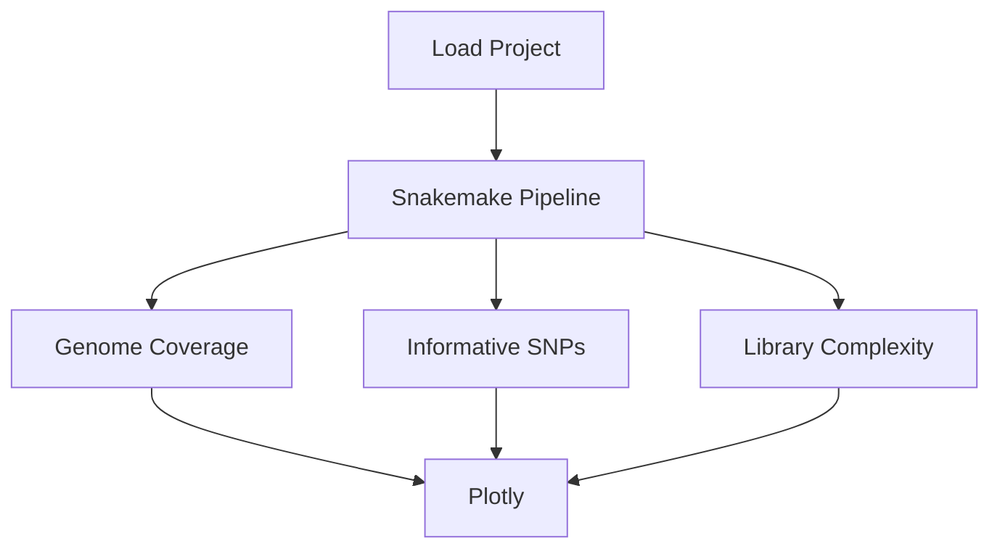

---
aliases:
  - Chromosome Resequencing
project: [[Plague Denmark]]
people:
  - [[Ravneet Sidhu]]
type:
  - [[Experiment]]
tags: 
  - ⬜/🚂  
  - 📝/🌿 
status:
  - priority
---

# Chromosome Resequencing Experiment

| Field   | Value              |
| ------- | ------------------ |
| Project | [[Plague Denmark]] |
| Date    | 2021-APR           | 

---

## Objectives
1. Identify [[Yersinia pestis]]-positive samples for [[resequencing]] based on:
	- [[Library complexity]]
	- [[Genome coverage]], specifically the [[chromosome]].
	- Informative [[SNP|SNPs]].
	
---

## Conclusions
1. The following enriched libraries are good candidates for resequencing:
	- D24, D62, D72, R21
2. The threshold of 50% coverage at 3X is a relatively good predictor of reaching the minimum number of informative [[SNP|SNPs]] for [[Phylogeny|phylogenetic]] applications.
3. All of the libraries that [[Ravneet Sidhu|Ravneet]] has enriched have drastically better complexity than libraries enriched by [[Katherine Eaton|Katherine]]. Some factors could be:
	- Different samples, with different preservation and infectious load.
	- Different baitsets, [[Ravneet Sidhu|Ravneet]] was the first to use the newly synthesized core baits.
	- Different technique, [[Ravneet Sidhu|Ravneet]] may have better laboratory technique somewhere in the workflow :)

---

<div style="page-break-after: always;"></div>

## Overview
1. Run the [[plague-phylogeography]] [[Snakemake]] pipeline for [[Medieval]] [[Denmark]] samples.
1. Calculate library complexity: [[Preseq]]. 
1. Calculate the number of informative SNPs: [[Snippy]].
1. Calculate genome coverage: [[Qualimap]].
1. Create charts: [[Plotly]].
1. Identify samples for [[resequencing]].




---

## Results

### Genome Coverage and SNPs

This stats table reflects the [[Genome coverage]] and [[SNP]]s merged across all libraries for a sample. The [[Black Death]] sample [[SAMN00715800|8291]] is included for context as a high coverage genome, and setting the minimum expected number of [[SNP|SNPs]].

```Coverage Status``` is set to 0 if the sample is below 50% and will be colored red on the following chart.

```SNP Status``` is set to 0 if the sample is below 90 SNPs and will be colored red on the following chart.

<iframe id="igraph" scrolling="no" style="border:none;" seamless="seamless" src="https://chart-studio.plotly.com/~ktmeaton/0.embed" height="525" width="100%"></iframe>


<br>
<iframe id="igraph" scrolling="no" style="border:none;" seamless="seamless" src="https://chart-studio.plotly.com/~ktmeaton/1.embed" height="525" width="100%"></iframe>

- The [[Coverage]] of the reference and the Number of [[SNP|SNPs]] is highly related.
- The threshold of 50% coverage at 3X is a relatively good predictor of reaching the minimum number of SNPs (relative to [[Black Death]] [[SAMN00715800|8291]]).
- Three samples have high coverage (70%+) and do not need resequencing.
	- D51, D71, D75, R36
- Five samples have moderate coverage (50-70%) which could be improved by resequencing.
	- D62, D72, P187, P212, P387
- Three samples have low coverage and moderate SNPs. Depending on the [[complexity curves]], they may be good candidates for resequencing.
	- D24, P384, R21
- Two samples have extremely low coverage and few SNPs. These are NOT good candidates for resequencing.
	- D25, P246, R44 

---

### Library Complexity

<iframe id="igraph" scrolling="no" style="border:none;" seamless="seamless" src="https://chart-studio.plotly.com/~ktmeaton/33.embed" height="525" width="100%"></iframe>

<br>
<iframe id="igraph" scrolling="no" style="border:none;" seamless="seamless" src="https://chart-studio.plotly.com/~ktmeaton/35.embed" height="525" width="100%"></iframe>

<iframe id="igraph" scrolling="no" style="border:none;" seamless="seamless" src="https://chart-studio.plotly.com/~ktmeaton/39.embed" height="525" width="100%"></iframe>

Based on the [[Chromosome Resequencing Experiment#Genome Coverage and SNPs|Genome Coverage and SNPs]], these plots are being used to evaluate whether medium and low coverage samples should be resequenced.

| Category | Sample | Description                          | Action     |
| -------- | ------ | ------------------------------------ | ---------- |
| Medium   | D62    | Still has an upward trajectory.      | Resequence |
| Medium   | D72    | Starting to plateau.                 | Resequence |
| Medium   | P187   | Plateaued with few unique molecules. | None       |
| Medium   | P212   | Plateaued with few unique molecules. | None       |
| Low      | P384   | Plateaued with few unique molecules. | None       |
| Low      | P387   | Plateaued with few unique molecules. | None       |
| Low      | R21    | Similar to D72.                      | Resequence |
| Low      | D24    | Marginally worse than D72.           | Resequence |
	
---

## Methods

### Data Preparation

1. Clone the [[plague-phylogeography]] projects repository.

	```bash
	git clone https://github.com/ktmeaton/plague-phylogeography-projects.git /2/scratch/keaton/plague-phylogeography-projects
	```

1. Load the [[Plague Denmark]] into the [[plague-phylogeography]] [[Snakemake]] pipeline.

	```bash
	workflow/scripts/project_load.sh results ../plague-phylogeography-projects/denmark rsync
	```
	
### Analysis

1. Run ```eager local``` to generate [[Preseq]] output.

	```bash
	snakemake eager_local --profile profiles/infoserv --configfile results/config/snakemake.yaml
	```

1. Create a [[MultiQC]] report.

	```bash
	snakemake multiqc_local --profile profiles/infoserv --configfile results/config/snakemake.yaml
	```
\*Note: This output was very messy and complicated. I used [[Plotly]] instead to make individual charts.

1. Prep tables for plotly.

	```bash
	cd plague-phylogeography-projects/denmark/multiqc/local/multiqc_data
	mkdir -p plotly
	cd plotly
	../../../../../scripts/plotly_preseq.sh ../mqc_preseq_plot_1.txt
	```
	
	The following samples had multiple libraries:
	
	- P187
	- P212
	- P246
	- P384
	- P387
	
	There appeared to be little significant variation between the libraries. I chose the M4 experiment on library a to be representative of each.
	
	\*Note: I just made the "Perfect" one manually.

1. Create a [[Snakemake]] report.

	```bash
	mkdir -p results/report/local/
	snakemake multiqc_local --report results/report/local/report.html --profile profiles/infoserv --configfile results/config/snakemake.yaml
	```


### Upload Results

1. Unload project results.

	```bash
	workflow/scripts/project_unload.sh results ../plague-phylogeography-projects/denmark rsync
	```

1. Upload project results.

	```bash
	cd ../plague-phylogeography-projects/
	git add -A
	git commit -m ""
	git push origin
	```

---

tags: [[Experiment]]