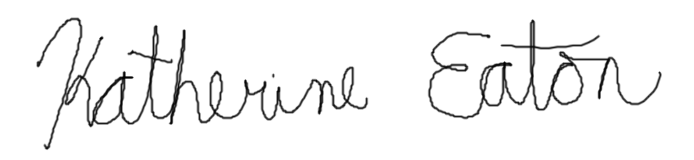

**Hendrik Poinar PhD**  
Michael G. DeGroote  
Institute for Infectious Disease Research	1280 Main St W  
McMaster University	Hamilton, ON, Canada  
905-525-9140 x26331, poinarh@mcmaster.ca	L8S 4L9  
&nbsp;  

01 December 2021  
&nbsp;  

Dr. Ripudaman Bains  
Senior Editor Microbiology and Infectious Disease Team  
_Nature Communications_  
&nbsp;  

Dear Dr. Bains,  
&nbsp;  

We are excited to submit an original and novel manuscript entitled _Plagued by a cryptic clock: Insight and issues from the global phylogeny of Yersinia pestis_.  
&nbsp;  

In this study we perform the most detailed phylogenetic and phylgeographic analysis on the largest dataset (N=601) of both ancient and modern plague (_Yersinia pestis)_ genomes. Plague is THE classic reemerging zoonotic infectious disease, responsible for numerous epidemics with catastrophic mortality and three historically documented pandemics. In the last few years ancient plague genomes have highlighted striking discrepancies between phylogenetic studies seeking to reconstruct _when_ and _where_ this disease first appeared in the past and how it moved in space. Many fanciful claims, parading as origins stories, permeate the literature yet lack the necessary robust statistical assessment as to their validity. In response to this, we identified _why_ these discrepancies occur with regards to methodological issues, and propose novel solutions and insights regarding the spatiotemporal history of plague.  
&nbsp;  
 

To achieve these goals, we produced an updated global phylogeny using all available _Y. pestis_ genomes at the time of writing. We then devised a novel approach for temporal modeling (ie. molecular clock) that led to robust divergence dates in some populations of plague but not others. We discovered that pandemic lineages of plague may have emerged decades, if not centuries, before epidemics were first documented. In addition, we found that the origins and spread of this disease cannot be confidently inferred from genetic data alone. We identify key historical datasets for future research, that will mitigate the weaknesses and complement the strengths of genetic evidence. We anticipate this manuscript to be of general interest to a wide range of researchers seeking to date and locate the emergence of human pathogens, with a particular focus on the cryptic evolutionary histories of zoonotic diseases.   
&nbsp;  

This study reflects a continuation of academic discourse concerning the deep history of plague and its reemergences in human populations. Previous studies on this topic have been published in _Nature Communications_ (ex. [10.1038/s41467-018-04550-9](https://www.doi.org/10.1038/s41467-018-04550-9) and [10.1038/s41467-019-12154-0](https://doi.org/10.1038/s41467-018-04550-9)) and are widely cited in the field. Furthermore, our study is the product of extensive interdisciplinary collaboration among anthropologists, geneticists, historians, and computational biologists. Reflecting this, our manuscript is targeted towards a diverse readership that is highly engaged in the topic of infectious disease history, which is why we think it would be an appropriate fit for _Nature Communications_.  
&nbsp;  

If our manuscript were to be considered for publication, we would like to suggest the following five individuals for peer-review: Dr. Ben Krause-Kyora (<b.krause-kyora@ikmb.uni-kiel.de>), Dr. Simon Rasmussen (<simon.rasmussen@cpr.ku.dk>), Dr. Johannes Krause (<krause@eva.mpg.de>, Dr. Philippe Lemey (<philippe.lemey@uz.kuleuven.ac.be>), and Dr. Simon Ho (<simon.ho@sydney.edu.au>). These researchers have extensive and active publication histories regarding the evolutionary history of plague and/or spatiotemporal reconstructions of pathogens using genomic data.  
&nbsp;  

All authors have approved the manuscript and consent to its submission to _Nature Communications_. The work described in this manuscript has not been previously discussed with a _Nature Communications_ editor, nor is it under consideration by another journal. The first author, Katherine Eaton, is the corresponding author for all communications regarding this manuscript. Thank you for taking the time to consider our study for publication in _Nature Communications_, we look forward to hearing from you.  
&nbsp;  

Sincerely,
&nbsp;  
&nbsp;  
&nbsp;  
&nbsp;  

Dr. Hendrik Poinar  (<poinarh@mcmaster.ca>)  
Professor of Anthropology  
Canada Research Chair    
&nbsp;  

{ height=50px align="left" }

Katherine Eaton (<eatonk3@mcmaster.ca>)  
PhD Candidate  
McMaster Ancient DNA Centre  

