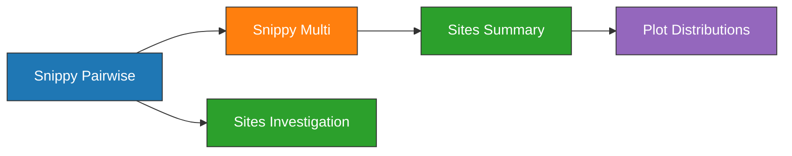

# Heterozygosity Experiment

| Field   | Value              |
| ------- | ------------------ |
| Project | [[Plague Denmark]] |
| Date    | [[2021-06-12]]     | 

---
## Objectives

> **1. Why do Denmark samples have high counts of heterozygosity?**
> 
> Conclusions:
> - Sites flagged as heterozygous by [[Snippy\|snippy core]] primarily have a low genotype quality.
> - Low quality can occur because the [[Alternate Allele]] has low counts.
> - One explanation is DNA damage (ex. deamination of cytosines).


> **2. How does this compare to other [[Second Pandemic]] samples?**
> 
> Conclusions:
> - The number of heterozygous sites in Danish samples is comparable, or less than, other Second Pandemic samples.
> - The distribution of homozygous and heterozygous is similar on a per sample basis.


---
## Outline




---
## Results

Two characteristics are being investigated:

1. Are there more homozygous sites than heterozygous sites?
2. Are the distributions of depth similar between homozygous and heterozygous sites? (ie. peak and spread)

### Baseline

| Sample           | Status | Graph                                                                                                                                                                   |
| ---------------- | ------ | ----------------------------------------------------------------------------------------------------------------------------------------------------------------------- |
| Black Death 8291 | Good   |   |
| STN021.A         | Bad    |  |


### [[Denmark]] Samples

| Sample | Status | Graph                                                                                                                                                          |
| ------ | ------ | -------------------------------------------------------------------------------------------------------------------------------------------------------------- |
| D51    | Good   |   |
| D62    | Good   |   |
| D71    | Good   |   |
| D72    | Good   |   |
| D75    | Good   |   |
| P187   | Good   |  |
| P212   | Good   |  |
| P387   | Good   |  |
| R36    | Good   |   |


---
## Methods

### Variant Calling

> Should snippy_multi be added to multiqc inputs?

```bash
snakemake snippy_multi_filter_all -np --profile profiles/infoserv
snakemake multiqc_all -np --profile profiles/infoserv
```

### Sites Summary

```bash

awk -F "\t" '{
if (NR==1){print $0"\tALIGNED_PERC\tVARIANT_PERC\tHET_PERC"} 
else{
  len=$2;
  aln=$3; 
  var=$5;  
  het=$6;
  aln_perc = (aln / len) * 100;
  var_perc = (var / len) * 100;
  het_perc = (het / len) * 100;
  print $0"\t"aln_perc"\t"var_perc"\t"het_perc}}' main/snippy_multi/all/snippy-multi.txt | column -t | less -S
```


```bash
awk -F "\t" '{
if (NR==1){print $0"\tALIGNED_PERC\tVARIANT_PERC\tHET_PERC"} 
else{
  len=$2;
  aln=$3; 
  var=$5;  
  het=$6;
  aln_perc = (aln / len) * 100;
  var_perc = (var / len) * 100;
  het_perc = (het / len) * 100;
  print $0"\t"aln_perc"\t"var_perc"\t"het_perc}}' snippy/snippy_multi/All_Samples_2021_0526/raw.txt | column -t | less -S
```

###  Extract Sites

How many SNPs in 8291 (SAMN00715800)? 

```bash
bcftools query -i 'TYPE="snp"' -f '%CHROM\t%POS\t%REF\t%ALT\t%QUAL\t%DP\t%AO\t[%GT]\n' SAMN00715800.raw.vcf | wc -l
1687
```

How many high quality homozygous SNPs?

```bash
bcftools query -i 'TYPE="snp" & GT="1/1" & QUAL>=100' -f '%CHROM\t%POS\t%REF\t%ALT\t%QUAL\t%DP\t%AO\t[%GT]\n' SAMN00715800.raw.vcf | wc -l
105
```

How many high quality heterozygous SNPs?

```bash
bcftools query -i 'TYPE="snp" & GT="0/1" & QUAL>=100' -f '%CHROM\t%POS\t%REF\t%ALT\t%QUAL\t%DP\t%AO\t[%GT]\n' SAMN00715800.raw.vcf | wc -l
64
```

### Summarize and Plot

```bash
head -n `awk 'END{print NR - 1}' results/snippy_multi/all/snippy-multi.txt` results/snippy_multi/all/snippy-multi.txt  | tail -n+2  | cut -f 1 | while read sample; 
do 
  in_vcf=`ls results/snippy_pairwise/*/$sample/${sample}.raw.vcf`;
  homo=${in_vcf%%.*}.homo.txt;
  het=${in_vcf%%.*}.het.txt;
  echo $sample;
  bcftools query -i 'TYPE="snp" & GT="1/1" & QUAL>=100' -f '%DP\n' $in_vcf | sort -h > $homo;
  bcftools query -i 'TYPE="snp" & GT="0/1" & QUAL>=100' -f '%DP\n' $in_vcf | sort -h > $het;
  /home/poinarlab/Projects/Plague/Denmark/scripts/plot_homo_het.py \
    --homo $homo \
    --het $het; 
done

mkdir results/heterozygosity
mv results/snippy_pairwise/{sra,local}/*/*.jpg results/heterozygosity/
```


---
## Conclusions


---

tags: [[Experiment]], #📝/🌱