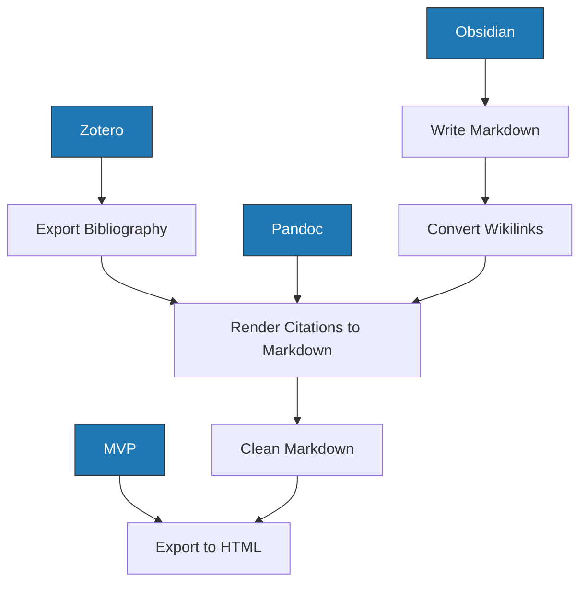

---
aliases:
  - Integrated Writing
tags:
  - 📝/🌱
---

# Integrated Writing

I have multiple different platforms that I write in. I would like to [[Integrated Writing|Integrate my Writing]].

## End Products

### Journal Article [[Manuscript]]

- [[PLOS Pathogens]] has a [[LaTeX]] template that can be downloaded [here](https://journals.plos.org/plospathogens/s/file?id=SyJ3/plos-latex-template.zip). [[pandoc/templates/PLOS/plos_latex_template.pdf|plos_latex_template.pdf]] is example output based on [[pandoc/templates/PLOS/plos_latex_template.tex|plos_latex_template.tex]]

## Tools

### [[Obsidian]]

- [[Obsidian]] is my editor and main powerhouse for writing, linking, and thinking.
- It uses [[Markdown]].

### [[Auspice]]

[[Auspice]] is my data visualization platform.
- It uses [[Markdown]].

### [[Zotero]]

[[Zotero]] is my [[Reference Manager]].

### [[Pandoc]]

[[Pandoc]] is an important [[Document Conversion]] tool.

### [[Manubot]] / [[Rootstock]]

[[Manubot]]/[[Rootstock]] is a manuscript preparation workflow. 

## Workflow

