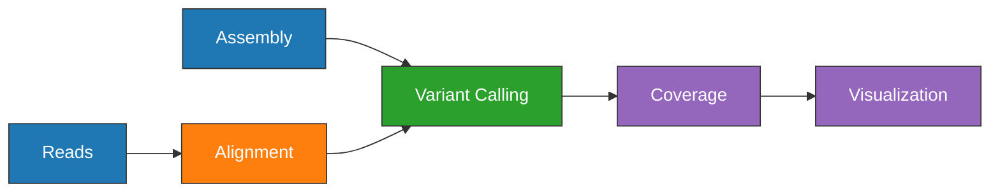

---
project:
due: 2021-09-07
people:
tags: ✨
status: done
title: Locus Coverage for Main Samples
type: [[Task]]
---

# Locus Coverage for Main Samples

1. Load
	```bash
	workflow/scripts/project_load.sh results ../plague-phylogeography-projects/main rsync
	```
1. Locus Coverage
	```bash
	snakemake --profile profiles/infoserv -np locus_coverage_collect_all
	```
1. Unload
	```bash
	workflow/scripts/project_unload.sh results ../plague-phylogeography-projects/main rsync
	```
	
## Pipeline



1. Alignment
	- Align fastq reads to reference, CO92 whole genome ([nf-core/eager]()).
	- Align fasta assemblies to reference, CO92 whole genome ([snippy]()).
2. Coverage
	- Mean sequencing depth of each genomic feature ([bedtools]()).
	- Mean breadth of coverage of each genomic feature ([bedtools]()).
3. Visualization
	- Python `seaborn`

## Manual

```bash
head -n1 results/locus_coverage/sra/SAMN15503568/locus_coverage.txt > results/locus_coverage_collect/all/locus_coverage.txt;

samples=(`tail -n+2 results/metadata/all/metadata.tsv | grep -v "Reference" | cut -f 1`)

for file in ${samples[@]}; do
	tail -n1 results/locus_coverage/*/$file/locus_coverage.txt >> results/locus_coverage_collect/all/locus_coverage.txt;
done


head -n1 results/locus_coverage/sra/SAMN15503568/locus_depth.txt > results/locus_coverage_collect/all/locus_depth.txt;
for file in ${samples[@]}; do
	tail -n1 results/locus_coverage/*/$file/locus_depth.txt >> results/locus_coverage_collect/all/locus_depth.txt;
done
```

## Results

### Low Samples

| population | strain  | country     | timetree_num_date | ratio               | baseline           |
| ---------- | ------- | ----------- | ----------------- | ------------------- | ------------------ |
| 2.MED      | 1530    | Russia      | 2014.0            | 0.2921464988598863  | 15.277467699999999 |
| 1.PRE      | STN021  | Switzerland | 1560.0            | 0.1183103565567792  | 82.6061478         |
| 1.PRE      | STN020  | Switzerland | 1560.0            | 0.1464414858457686  | 91.2597733         |
| 1.PRE      | STN019  | Switzerland | 1560.0            | 0.11927742746428247 | 64.3919907         |
| 1.PRE      | STN014  | Switzerland | 1560.0            | 0.3015840544015849  | 104.81750490000002 |
| 1.PRE      | STN013  | Switzerland | 1560.0            | 0.10663957021433111 | 42.612663299999994 |
| 1.PRE      | STN008  | Switzerland | 1560.0            | 0.12613486042319433 | 34.2281189         |
| 1.PRE      | STN007  | Switzerland | 1560.0            | 0.1344142361436589  | 75.03072359999999  |
| 1.PRE      | STN002  | Switzerland | 1560.0            | 0.13906312502558335 | 54.9087524         |
| 1.PRE      | STA001  | Germany     | 1525.0            | 0.1783747573585643  | 71.31005859999999  |
| 1.PRE      | NMS002  | England     | 1505.5            | 0.15222019481669333 | 68.36685179999999  |
| 1.PRE      | LBG002  | Germany     | 1543.5            | 0.11858709475264144 | 38.094970700000005 |
| 1.PRE      | ELW098  | Germany     | 1556.0            | 0.17494893857393717 | 76.7849197         |
| 1.PRE      | BRA001  | Germany     | 1633.0            | 0.21771902416838304 | 86.83798979999999  |
| 1.PRE      | BED034  | England     | 1597.5            | 0.16226251938588318 | 64.1750488         |
| 1.PRE      | BED030  | England     | 1597.5            | 0.24550753901301878 | 202.12849430000003 |
| 1.PRE      | BED028  | England     | 1597.5            | 0.17126629936186885 | 121.19832609999999 |
| 1.PRE      | BED024  | England     | 1597.5            | 0.10016844460482563 | 64.4813766         |
| 0.ANT4     | LSD020  | France      | 765.0             | 0.13468634786178263 | 44.5400391         |
| 0.ANT4     | LSD001  | France      | 765.0             | 0.19973423783547903 | 86.9739304         |
| 1.PRE      | CHE1    | Russia      | 1650.0            | 0.22730941483888947 | 279.9944153        |
| 1.PRE      | Azov38  | Russia      | 1550.0            | 0.10285751846675974 | 46.094970700000005 |
| 1.PRE      | AGU010  | Lithuania   | 1456.0            | 0.14886164512114827 | 119.687149         |
| 1.PRE      | AGU025  | Lithuania   | 1526.5            | 0.11952577587910218 | 66.6638718         |


### High Samples

| sample                             | population | strain     |
| ---------------------------------- | ---------- | ---------- |
| GCA_000325265.1_ASM32526v1_genomic | 3.ANT      | MGJZ6      |
| GCA_000324945.1_ASM32494v1_genomic | 2.MED      | H1958004   |
| GCA_000323985.1_ASM32398v1_genomic | 1.ORI      | CMCC114001 |
| GCA_000323665.1_ASM32366v1_genomic | 0.ANT      | 945        |