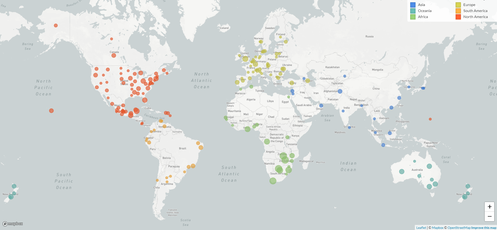

## Big Data, Small Microbes
### Genomic analysis of the plague bacterium _Yersinia pestis_

 

### Katherine Eaton                            

#### PhD Defense | Department of Anthropology | McMaster University
#### 21 January 2022

note: 

---

## Land Acknowledgement

<grid  drag="80 30" drop="10 20" flow="col">
_I acknowledge the traditional land on which I reside, is in Treaty Six Territory. I would like to thank the diverse Indigenous Peoples whose ancestors’ footsteps have marked this territory for centuries, such as nêhiyaw, Dené, Anishinaabe, Nakota Isga, and Niitsitapi peoples. I also acknowledge this as the Métis’ homeland and the home of one of the largest communities of Inuit south of the 60th parallel._
</grid>

<grid  drag="40 40" drop="10 -12" flow="col">
[native-land.ca](https://native-land.ca/)

</img>

</grid>

<grid  drag="35 56" drop="-10 -1" flow="col">
[firstnations.org](https://www.firstnations.org/knowledge-center/recipes/)
  

</img>

note: I'd like to start out today with a land acknowledgement. While I live in Edmonton, Alberta...

- _nêhiyaw_ (NAY-hee-yow)
- Dené (DEH-neyh) (short)
- Anishinaabe (AH-nish-in-ah-abay)
- Nakota Isga (Na-KOHHH-tah EE-ska)
- Niitsitapi (Nit-si-tuhp-ee)
- Métis’ (May-tea)

To learn more about the history of where we live, there's two resources I really enjoy. One is native-land.ca, where you can see all the nations that are found within Canada. And also firstnations.org has published free cookbooks, and I've really enjoyed learning about dishes made with plants that are found in my backyard.

</grid>

---

## Overview

note: In this presentation, 

---

## Overview

</img>

---

## NCBImeta

### Efficient and comprehensive metadata retrieval from NCBI databases

---

## Plagued by a Cryptic Clock

### Insight and issues from the global phylogeny of _Yersinia pestis_

---

## Plague in Denmark (1000-1800)

### A longitudinal study of _Yersinia pestis_

---
