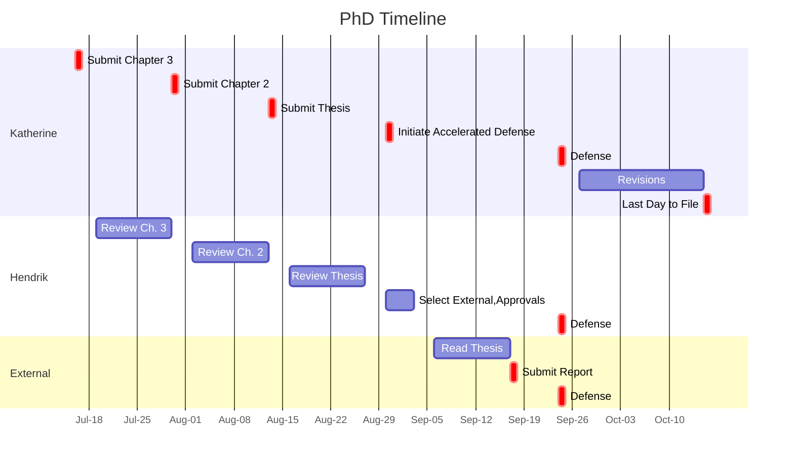

```mermaid
gantt
	dateFormat  YYYY-MM-DD
	title PhD Timeline
	axisFormat %b-%d

	section Katherine
	Submit Chapter 3               	:   crit,submit-chap3,	    2021-07-16, 2021-07-17
	Submit Chapter 2               	:   crit,submit-chap2,	    2021-07-30, 2021-07-31	
	Submit Thesis            		:   crit,submit-diss,	    2021-08-13, 2021-08-14	
	Initiate Accelerated Defense	:	crit,defense-initiate,	2021-08-30, 2021-08-31
	Defense 	           			:	crit,defense,			2021-09-24, 2021-09-25
	Revisions 	           			:	revisions,				2021-09-27, 2021-10-15	
	Last Day to File 	           	:	crit,revisions,			2021-10-15, 2021-10-16
	
	section Hendrik
	Review Ch. 3					:	diss-chap3,	        	2021-07-19, 2021-07-30
	Review Ch. 2					:	diss-chap2,	        	2021-08-02, 2021-08-13	
	Review Thesis     				:   diss-review,	    	2021-08-16, 2021-08-27	
	Select External,Approvals		:	select-ext,     		2021-08-30, 2021-09-03
	Defense 	           			:	crit,defense,			2021-09-24, 2021-09-25	
	
	section External
	Read Thesis	       				:	external-read,    		2021-09-06, 2021-09-17
	Submit Report        			:	crit,external-report,	2021-09-17, 2021-09-18	
	Defense 	           			:	crit,defense,			2021-09-24, 2021-09-25	
	
```