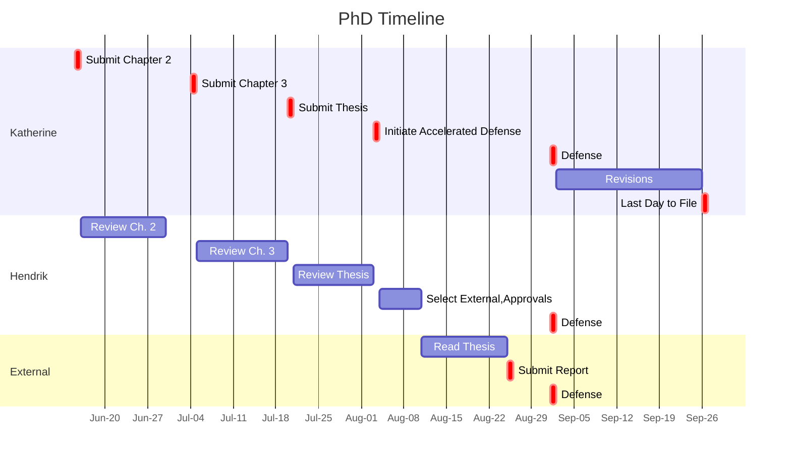

```mermaid
gantt
	dateFormat  YYYY-MM-DD
	title PhD Timeline
	axisFormat %b-%d

	section Katherine
	Submit Chapter 2               	:   crit,submit-chap2,	    2021-06-15, 2021-06-16	
	Submit Chapter 3               	:   crit,submit-chap3,	    2021-07-04, 2021-07-05
	Submit Thesis            		:   crit,submit-diss,	    2021-07-20, 2021-07-21	
	Initiate Accelerated Defense	:	crit,defense-initiate,	2021-08-03, 2021-08-04
	Defense 	           			:	crit,defense,			2021-09-01, 2021-09-02
	Revisions 	           			:	revisions,				2021-09-02, 2021-09-26	
	Last Day to File 	           	:	crit,revisions,			2021-09-26, 2021-09-27
	
	section Hendrik
	Review Ch. 2					:	diss-chap2,	        	2021-06-16, 2021-06-30	
	Review Ch. 3					:	diss-chap3,	        	2021-07-05, 2021-07-20
	Review Thesis     				:   diss-review,	    	2021-07-21, 2021-08-03	
	Select External,Approvals		:	select-ext,     		2021-08-04, 2021-08-11
	Defense 	           			:	crit,defense,			2021-09-01, 2021-09-02	
	
	section External
	Read Thesis	       				:	external-read,    		2021-08-11, 2021-08-25
	Submit Report        			:	crit,external-report,	2021-08-25, 2021-08-26	
	Defense 	           			:	crit,defense,			2021-09-01, 2021-09-02	
	
```