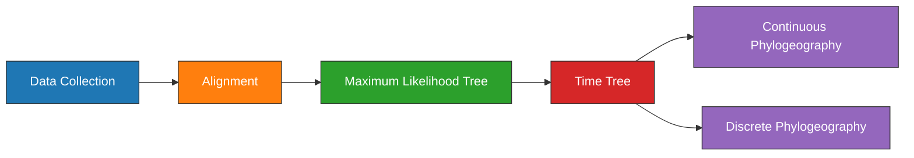

---
aliases:
  - Phylogeography Experiment
title:
  - Phylogeography Experiment
tags:
  - ⬜/🧨 
status:
  - priority
---

# Phylogeography Experiment

| Field   | Value       |
| ------- | ----------- |
| Project | [[Plague Phylodynamics and Phylogeography]] |
| Date    | [[2021-03-31]]            |

## Objectives
---

1. Estimate a global phylogeny of modern and ancient [[Yersinia pestis]].
1. Explore the temporal structure and variation.
1. Visualize the geographic [[Spread|dispersal]] of specific clades on a map.

## Outline
---



## Methods
---

### Data Collection
[[Zhou 2020 EnteroBase User Guide|Zhou et al. (2020)]] described how the number of sequences is rapidly expanding. 1693 [[Yersinia pestis|Y. pestis]] genome sequencing projects were identified from the NCBI databases using [[NCBImeta_Paper]]. Collection date and geographic location were curated by cross-referencing the original publications. [[Geocode|Geocoding]] was performed using [[GeoPy]] and the [[Nominatim|Nominatim API]] for [[OpenStreeMap]]. Latitude and longitude for each sample were standardized at the levels of country and state. Genomes were removed if no associated date or location information were removed, or if there was documented evidence of laboratory manipulation. After curation, 600 genomes remained, with 539 (90%) being modern in origin and 61 (10%) being ancient.

To estimate the phylogeny root, two genomes from the outgroup [[Yersinia pseudotuberculosis]] were downloaded, strain NCTC10275 and strain IP32953.

| [[Geographic]] [[Distribution\|distribution]] of [[Yersinia pestis]] [[Genome\|genomes]]. |
| ------------------------------------------------------------------------------------------------------------------- |
|    ![[map_comparison.png]]                                                            |
|                                                                                                                     |

The ancient samples are primarily collected from [[Europe]], with a few unique samples drawn from [[Central Asia]]. In contrast, the modern samples are primarily drawn from [[East Asia|East]] and [[Central Asia]]. Contrast this with the known geographic distribution of modern plague ([[Xu et al. 2019 Historical Genomic Data|Xu et al. 2019]]).


#### Code
- SQL statement (Assembly):
	```sql
	SELECT
    	AssemblyFTPGenbank
	FROM
		BioSample
	LEFT JOIN Assembly
		ON AssemblyBioSampleAccession = BioSampleAccession
	WHERE
		(BioSampleComment LIKE '%KEEP%Assembly%Modern%' 
	  	AND length(AssemblyFTPGenbank) > 0 
	  	AND length(BioSampleCollectionDate) > 0
	  	AND length(BioSampleGeographicLocation) > 0)
		OR (BioSampleComment LIKE '%KEEP%Assembly%Modern%Outgroup%')
	```
- SQL statement (SRA):
	```sql
	SELECT
		BioSampleAccession,
	  	SRARunAccession
	FROM
	  	BioSample
	LEFT JOIN SRA
	  	ON SRABioSampleAccession = BioSampleAccession
	WHERE
		(BioSampleComment LIKE '%KEEP%SRA%Ancient%' 
		AND SRAComment NOT LIKE "%REMOVE%")
	  	AND length(BioSampleCollectionDate) > 0
	  	AND length(BioSampleGeographicLocation) > 0		
	```
- Load project:
	```bash
	workflow/scripts/project_load.sh results ../plague-phylogeography-projects/main rsync
	```

### [[Alignment]]
---

Pre-processing of the ancient samples and reference-based was performed using the [[nf-core/eager]] pipeline. The [[Snippy|snippy pipeline]] was used to perform variant calling and multiple alignment across all modern and ancient samples.

The output multiple alignment was filtered to only include chromosomal regions, and exclude sites that were singletons or had more than 5% missing data.

#### Code

- Create multiple alignments and plot missing data across sites (no singletons):

	```bash
	snakemake snippy_multi_prune_all --profile profiles/infoserv
	```


### [[Maximum-likelihood]] [[Phylogenetic|Tree]]
---
Model selection was performed using [[Modelfinder]] and a [[Maximum-likelihood|maximum-likelihood]] tree was estimated across 10 independent runs of [[IQTREE]] using a K3Pu+F+I model. Branch support was evaluated using 1000 iterations of the ultrafast bootstrap approximation  [[Hoang 2018 UFBoot2 Improving Ultrafast|UFBoot]], with a threshold of 95% required for strong support.

### [[Timetree|Time Tree]]

A time-scaled [[Phylogenetic|phylogeny]] was estimated using the least-squares criteria as implemented in [[To 2016 Fast Dating Using|LSD2]]. The [[Yersinia pseudotuberculosis|Y. pseudotuberculosis]] clade was used to mark the outgroup, with the root estimated on this branch. Node uncertainty was estimated using a lognormal relaxed clock, with a distribution mean of 1 and standard deviation of 0.2.

#### Code
1. Estimate a time-scaled phylogeny tree.
	```bash
	snakemake lsd_all --profile profiles/infoserv
	```


### [[Continuous]] [[Phylogeography]]
[[Continuous]] trait phylogeography was performed using the [[GEO_SPHERE]] package in [[BEAST|BEAST2]] using a fixed tree.


```bash
mkdir beast1 beast2 beast3 beastMC3;
sed  "s/beast.trees/beast1.trees/g" beast.xml | sed "s/beast.log/beast1.log/g" > beast1/beast1.xml;
sed  "s/beast.trees/beast2.trees/g" beast.xml | sed "s/beast.log/beast2.log/g" > beast2/beast2.xml;
sed  "s/beast.trees/beast3.trees/g" beast.xml | sed "s/beast.log/beast3.log/g" > beast2/beast3.xml;
cp beast.xml beastMC3/beastMC3.xml;
```

```
<run id="mcmc" spec="beast.coupledMCMC.CoupledMCMC" chainLength="10000000" chains="4" target="0.234" logHeatedChains="true" deltaTemperature="0.1" optimise="true" resampleEvery="1000" >
```

```
screen -S beast-runs
beast -overwrite -threads 5 -beagle -seed 10000000 beast1.xml | tee beast1.screenlog
beast -overwrite -threads 5 -beagle -seed 20000000 beast2.xml | tee beast2.screenlog
beast -overwrite -threads 5 -beagle -seed 30000000 beast3.xml | tee beast3.screenlog
beast -overwrite -threads 5 -beagle -seed 40000000 beastMC3.xml | tee beastMC3.screenlog
```

#### Code

1. Create directory:
	```bash
	snakemake beast_geo_all -np --profile profiles/infoserv
	```
1. Run Parameters:
	```YAML
	alignment:
	  - beast.fasta
	spherical-geometry:
	  - trait: geo
	  - tree:  clock_model_beauti.nex
	  - lat:   clock_model_lat.tsv
	  - lon:   clock_model_lon.tsv
	clock-model: relaxed-clock-log-normal
	MCMC:
	  - chain-length: 10,000,000
	  - sample-every: 1000
	  - tree-every:   1000
	  - screen-every: 1000
	output: beast.xml
	```
1. Run the analysis.
	```bash
	beast -seed 45740554 -threads 4 -beagle_SSE -beagle_double beast.xml | tee beast_screen.log
	```
	- Sampling rate: X/Msamples

##### Preview

- Preview states in the trace:
	```bash
	 header=`grep "#" main_trace.log  | wc -l`
	 states=100;
	 lines=`echo "$(( $header + 2 + $states ))"`
	 head -n $lines main_trace.log > main_trace_100000.log
	```
- Preview the distribution of trees:
	```bash
	 header=`grep -v "tree STATE" main.trees | wc -l`;
	 states=100;
	 lines=`echo "$(( $header + 1 + $samples ))"`	
	 head -n $lines main.trees > main_100000.trees
	```
- Preview the MCC tree.
	```bash
	treeannotator -burnin 10 -hpd2D 0.95 main_100000.trees main_100000_mcc_hpd95.nex
	```

##### Post

1. [ ] Examine the tracelog with [[Tracer]].
1. [ ] Examine the distribution of trees with [[DensiTree]].
1. [ ] Create an [[Maximum Clade Credibility|MCC]] tree with [[TreeAnnotator]].
	```bash
	treeannotator -burnin 10 -hpd2D 0.95 main.trees main_mcc_hpd95.nex
	```
1. [ ] Create a geospatial visualization with [[spreaD3]].

| [[Spread\| Dispersal]] of  [[Y. pestis]] during the [[LNBA]] |
| ---------------------------------------------------- | ------------------------------------------------ |
| ![[eaton2021PlaguePhylogeography_spreaD3-0.PRE.jpg]] |                                                  |

## Results

### Overview

| Root To Tip Regression | Isolation By Distance |
|:----------------------:|:---------------------:|
|  ![[rtt_all 2.png]]    |    ![[ibd_all 2.png]]|

### Clades

#### Root To Tip Regression

The only clades that show temporal structure are the ancient clades:
- [[0.PRE]] : [[LNBA|Late Neolithic Bronze Age]]
- [[0.ANT4]] : [[Plague of Justinian]]
- [[1.PRE]] : [[Black Death]]/[[Medieval Europe]]

![[rtt_clades.png]]

#### Tip Dating

![[tip-dating 1.png]]

#### IBD

![[ibd_clades.png]]

---

## Conclusions


---

tags: [[Experiment]]