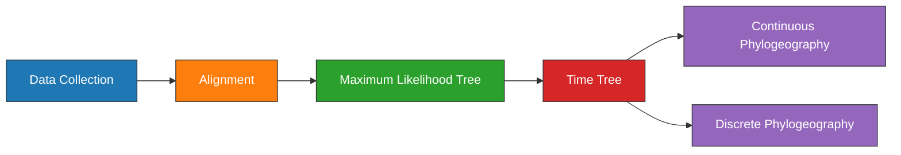

---
aliases:
  - Plague Denmark Phylogeography
---

# Plague Denmark Phylogeography Experiment

| Field   | Value |
| ------- | ----- |
| Project | [[Plague Denmark]]|
| Date    | [[2021-06-16]]      | 

---
## Objectives

1. Estimate a [[Maximum-likelihood\|maximum-likelihood]] [[Phylogenetic\|phylogeny]] of [[Second Pandemic]] [[Plague]] genomes.
1. Estimate a clock model and geographic model using [[BEAST]].

---
## Outline



---
## Methods

### Data Collection

#### Code
- SQL statement (Assembly). The only assemblies used are clade [[0.ANT3]] to serve as an outgroup.
	```sql
	SELECT
    	AssemblyFTPGenbank
	FROM
		BioSample
	LEFT JOIN Assembly
		ON AssemblyBioSampleAccession = BioSampleAccession
	WHERE
		(BioSampleComment LIKE '%KEEP%Assembly%Modern%' 
	  	AND length(AssemblyFTPGenbank) > 0 
	  	AND length(BioSampleCollectionDate) > 0
	  	AND length(BioSampleGeographicLocation) > 0)
		AND BioSampleBranch LIKE '%0%ANT3%'
	```
- SQL statement (SRA). The only SRA samples used are clade [[1.PRE]] to be the ingroup.
	```sql
	SELECT
		BioSampleAccession,
	  	SRARunAccession
	FROM
	  	BioSample
	LEFT JOIN SRA
	  	ON SRABioSampleAccession = BioSampleAccession
	WHERE
		(BioSampleComment LIKE '%KEEP%SRA%Ancient%' 
		AND SRAComment NOT LIKE "%REMOVE%")
	  	AND length(BioSampleCollectionDate) > 0
	  	AND length(BioSampleGeographicLocation) > 0	
		AND BioSampleBranch LIKE "%1.PRE%"
	```
- SQL statement (Local). 
	```sql
	SELECT
		BioSampleAccession
	FROM
		BioSample
	WHERE
		(BioSampleComment LIKE '%KEEP%Local%Denmark%')
	```

- Load project:
	```bash
	workflow/scripts/project_load.sh results ../plague-phylogeography-projects/denmark rsync
	```

---
### [[Alignment]]


Pre-processing of the ancient samples and reference-based was performed using the [[nf-core/eager]] pipeline. The [[Snippy|snippy pipeline]] was used to perform variant calling and multiple alignment across all modern and ancient samples.

The output multiple alignment was filtered to only include chromosomal regions, and to exclude sites with excessive missing data. A missing data threshold was selected based on:

- 30% is the final threshold before singletons overtake parsimony sites.
- At 30% missing data, 10% of the alignment is ambiguous characters.

<iframe id="igraph" scrolling="no" style="border:none;" seamless="seamless" src="https://rawcdn.githack.com/ktmeaton/plague-phylogeography-projects/4b5d1f7/denmark/snippy_multi/all/chromosome/full/snippy-multi.snps.missing-data.html" height="540px" width=900px ></iframe>

<iframe id="igraph" scrolling="no" style="border:none;" seamless="seamless" src="https://rawcdn.githack.com/ktmeaton/plague-phylogeography-projects/4b5d1f7/denmark/snippy_multi/all/chromosome/full/snippy-multi.snps.ambig-nuc.html" height="540px" width=900px ></iframe>

#### Code

- Create multiple alignments and plot missing data across sites (no singletons):

	```bash
	snakemake plot_missing_data_all --profile profiles/infoserv
	```


---
### [[Maximum-likelihood]] [[Phylogenetic|Tree]]

Model selection was performed using [[Modelfinder]] and a [[Maximum-likelihood|maximum-likelihood]] tree was estimated across 10 independent runs of [[IQTREE]] using a K3Pu+F+I model. Branch support was evaluated using 1000 iterations of the ultrafast bootstrap approximation  [[Hoang 2018 UFBoot2 Improving Ultrafast|UFBoot]], with a threshold of 95% required for strong support.

```bash
snakemake iqtree_filter_all --profile profiles/infoserv
```

---
### [[Clock Model]]

#### Models Overview

| Model          | Dates | Run Type      |
| -------------- | ----- | ------------- |
| Strict (SC)    | Yes   | Regular       |
|                |       | Path-Sampling |
|                | No    | Regular       | 
|                |       | Path-Sampling |
|                |       |               |
| Relaxed (UCLN) | Yes   | Regular       |
|                |       | Path-Sampling |
|                | No    | Regular       |
|                |       | Path-Sampling |

#### Directory Structure

```yaml
strict_clock:
  - dates:
  	- run
	- model_test
  - no_dates:
  	- run
	- model_test
relaxed_clock:
  - dates:
  	- run
	- model_test  
  - no_dates:
  	- run
	- model_test  
  
```

```bash
mkdir -p strict_clock/dates/run/ ;
mkdir -p strict_clock/dates/model_test/ ;

mkdir -p strict_clock/no_dates/run/ ;
mkdir -p strict_clock/no_dates/model_test/ ;

mkdir -p relaxed_clock/dates/run/ ;
mkdir -p relaxed_clock/dates/model_test/ ;

mkdir -p relaxed_clock/no_dates/run/ ;
mkdir -p relaxed_clock/no_dates/model_test/ ;
```

#### Inputs

Nexus and newick files:
```bash
cd /mnt/c/Users/ktmea/Projects/plague-phylogeography-projects/denmark

/mnt/c/Users/ktmea/Projects/plague-phylogeography/workflow/scripts/beast_nexus.py \
  -m iqtree/all/chromosome/full/filter30/filter-taxa/metadata.tsv \
  -a iqtree/all/chromosome/full/filter30/filter-sites/snippy-multi.snps.aln \
  --nwk iqtree/all/chromosome/full/filter30/filter-taxa/iqtree.treefile \
  --nex beast/all/chromosome/full/filter30/beast.nex  

cp iqtree/all/chromosome/full/filter30/filter-taxa/iqtree.treefile beast/all/chromosome/full/filter30/beast.nwk
```

#### Beauti

1. Import alignment (```beast.nex```).
1. Rename partitions (```dna```).
1. Site Model (```GTR```).
1. Tree Prior: (```Coalescent Constant Population```).
1. Add MRCA Prior (```Ingroup```)
	- Excludes the outgroup taxon ```SAMEA5818806```.
	- None distribution
	- Is monophyletic.
1. Chain Length (100,000,000)
2. Chain samples (10,000).
3. Screen log (100,000).
4. Save As -> ```beast.xml```
5. Inspect the XML, to make sure the tip dating priors were setup correctly and logged. 


#### XML Edit

1. Add constant sites
	```xml
	# Change
	<data id="dna" spec="Alignment" name="alignment">
	#To
	<data id="original-dna" spec="Alignment" name="original-dna">	
	# Add
	<data id="dna" spec="FilteredAlignment" filter="-" data="@original-dna" constantSiteWeights="1126849 1014112 1025137 1123712"/>	
	```

#### Model Testing

https://groups.google.com/g/beast-users/c/nGivwwqKRgM

> *"The "path sampling" available in BEAST2's MODEL_SELECTION is actually stepping-stone sampling. It is a straightforward implementation of the stepping-stone method described in Xie et al. Path sampling and stepping-stone sampling are similar - stepping-stone is slightly more efficient, but given enough steps either should be very accurate."*

>*"If set up the analysis and left alpha to 0.3 (which is the default value), you actually calculated the stepping stone estimate with the (confusingly named) PathSampleAnalyser."*

https://beast.community/model_selection_1

> *"We suggest to specify a number of path steps of either 50 or 100, with the lenght of each chain being at least 250.000 iterations. In general, it’s probably a good idea to run a total amount of iterations (i.e. number of path steps times chain length) equal to the length of the standard BEAST analysis performed to estimate the various parameters. Given that the Beta(0.3; 1.0) distribution to determine the power posteriors has been shown to deliver adequate performance (Xie et al., 2011), we currently only allow this distribution to be used. Through XML specification (see below), other options for this distribution can be specified."*

```bash
cp strict_clock/dates/run/beast.xml strict_clock/dates/model_test/beast.xml;
cp strict_clock/no_dates/run/beast.xml strict_clock/no_dates/model_test/beast.xml;
cp relaxed_clock/dates/run/beast.xml relaxed_clock/dates/model_test/beast.xml;
cp relaxed_clock/no_dates/run/beast.xml relaxed_clock/no_dates/model_test/beast.xml;
```

1. Change ```<run>``` element to ```mcmc```.
1. Add a new ```<run>``` element before the mcmc.
	```xml
	<run spec="beast.inference.PathSampler"
		chainLength="1000000"
		alpha="0.3"
		rootdir="/2/scratch/keaton/plague-phylogeography-projects/denmark/beast/all/chromosome/full/filter30/....."
		burnInPercentage="0"
		preBurnin="100000"
		deleteOldLogs="true"
		nrOfSteps="100">
    	cd $(dir)
    	java -cp $(java.class.path) beast.app.beastapp.BeastMain $(resume/overwrite) -java -seed $(seed) beast.xml		
	```

|  Clock  |  Dates   | Marginal Likelihood | Bayes Factor (Dates) | Bayes Factor (Clock) |
|:-------:|:--------:|:-------------------:|:--------------------:|:--------------------:|
| Strict  |  Dates   | -5948088.362111656  |        748.87        |          --          |
| Strict  | No Dates | -5948837.229225709  |          --          |          --          |
| Relaxed |  Dates   | -5947948.032380212  |        715.37        |        140.33        | 
| Relaxed | No Dates | -5948663.405502648  |          --          |        173.82        |

- Decisive support for temporal signal using both strict clock and relaxed clock.
- Decisive support for the relaxed clock over a strict clock.

#### Checklist

- [x] Beauti XMLs
	- [x] Strict clock
		- [x] Dates
		- [x] No Dates
	- [x] Relaxed Clock
		- [x] Dates
		- [x] No Dates
- [x] Constant sites
	- [x] Strict clock
		- [x] Dates
		- [x] No Dates
	- [x] Relaxed Clock
		- [x] Dates
		- [x] No Dates
- [x] Model Test
	- [x] Strict clock
		- [x] Dates
		- [x] No Dates
	- [x] Relaxed Clock
		- [x] Dates
		- [x] No Dates

#### Run
Activate conda environment:
```bash
conda activate beast2
```

1. Strict clock with dates
	```bash
	cd strict_clock/dates/run;
	beast \
	  -seed 4141239047 \
	  -threads 5 \
	  -beagle_SSE \
	  -beagle_double \
	  beast.xml | tee beast_screen.log
	  
	cd ../model_test/;
	beast \
	  -seed 4141239047 \
	  -threads 5 \
	  -beagle_SSE \
	  -beagle_double \
	  beast.xml | tee beast_screen.log	
	```
2. Strict clock without dates
	```bash
	cd strict_clock/no_dates/run;
	beast \
	  -seed 75273452 \
	  -threads 5 \
	  -beagle_SSE \
	  -beagle_double \
	  beast.xml | tee beast_screen.log
	  
	cd ../model_test/;
	beast \
	  -seed 75273452 \
	  -threads 5 \
	  -beagle_SSE \
	  -beagle_double \
	  beast.xml | tee beast_screen.log		  
	```
3. Relaxed clock with dates
	```bash
	cd relaxed_clock/dates/run;
	beast \
	  -seed 1259807514 \
	  -threads 5 \
	  -beagle_SSE \
	  -beagle_double \
	  beast.xml | tee beast_screen.log
	  
	cd ../model_test/;
	beast \
	  -seed 1259807514 \
	  -threads 5 \
	  -beagle_SSE \
	  -beagle_double \
	  beast.xml | tee beast_screen.log		  
	```
4. Relaxed clock without dates
	```bash
	cd relaxed_clock/no_dates/run;
	beast \
	  -seed 5435425542 \
	  -threads 5 \
	  -beagle_SSE \
	  -beagle_double \
	  beast.xml | tee beast_screen.log
	  
	cd ../model_test/;
	beast \
	  -seed 5435425542 \
	  -threads 5 \
	  -beagle_SSE \
	  -beagle_double \
	  beast.xml | tee beast_screen.log		  
	```
	
#### MCC Trees

```bash
treeannotator -burnin 10 beast.trees beast_mcc.nex
```

### Phylogeography

> *"...the Cauchy RRW model and by specifying that Bivariate trait represents latitude and longitude (fig. 2D). The latter option allows estimating diffusion statistics that are specific for bivariate spatial traits (with latitude and longitude in that order). “Cauchy” refers to the name of the probability distribution that is here used to accommodate dispersal velocity variation among phylogeny branches. We also select the option Add random jitter to tips, which adds noise to sampling coordinates. With this option, the noise is drawn uniformly at random from a particular Jitter window size to duplicated (location) traits. Here, we set the jitter window size to 0.01, which will add a small noise that will avoid a poor performance of the RRW model when not all sequences are associated with unique sampling coordinates. The choice of the jitter value is arbitrary, but it should remain sufficiently small to avoid alternating too much the actual geographic origin of each sample (see also our discussion below about alternatives to the jitter option)."*

- I will use a relaxed clock model with dates for continuous phylogeography.

	```bash
	cd relaxed_clock/dates/geo;
	beast \
	  -seed 435541709 \
	  -threads 5 \
	  -beagle_SSE \
	  -beagle_double \
	  beast.xml | tee beast_screen.log
	```

## Results

(1797.5 )

| Lab ID | Arch ID | Date (Mean) | Date (95% HPD) |
| ------ | ------- | ----------- | -------------- |
| D51    |         |             |                | 
| D62    |         |             |                |
| D71    |         |             |                |
| R36    |         |             |                |
| P387   |         |             |                |
| P187   |         |             |                |
| P212   |         |             |                |
| D51    |         |             |                |
| D72    |         |             |                |
| D75    |         |             |                |

---
## Conclusions

## References


Bouckaert, Remco, Timothy G. Vaughan, Joëlle Barido-Sottani, Sebastián Duchêne, Mathieu Fourment,
Alexandra Gavryushkina, Joseph Heled, Graham Jones, Denise Kühnert, Nicola De Maio, Michael Matschiner,
Fábio K. Mendes, Nicola F. Müller, Huw A. Ogilvie, Louis du Plessis, Alex Popinga, Andrew Rambaut,
David Rasmussen, Igor Siveroni, Marc A. Suchard, Chieh-Hsi Wu, Dong Xie, Chi Zhang, Tanja Stadler,
Alexei J. Drummond
  BEAST 2.5: An advanced software platform for Bayesian evolutionary analysis.
  PLoS computational biology 15, no. 4 (2019): e1006650.

Drummond AJ, Ho SYW, Phillips MJ, Rambaut A (2006) Relaxed Phylogenetics and
  Dating with Confidence. PLoS Biol 4(5): e88

Remco R. Bouckaert. Phylogeography by diffusion on a sphere: whole world phylogeography. 2016, PeerJ 4:e2406 https://doi.org/10.7717/peerj.2406

---

tags: [[Experiment]], #📝/🌱