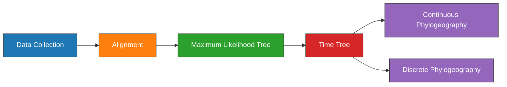

---
aliases:
  - Plague Denmark Phylogeography
---

# Plague Denmark Phylogeography Experiment

| Field   | Value |
| ------- | ----- |
| Project | [[Plague Denmark]]|
| Date    | [[2021-06-16]]      | 

---
## Objectives

1. Estimate a [[Maximum-likelihood\|maximum-likelihood]] [[Phylogenetic\|phylogeny]] of [[Second Pandemic]] [[Plague]] genomes.

---
## Outline



---
## Methods

### Data Collection

#### Code
- SQL statement (Assembly). The only assemblies used are clade [[0.ANT3]] to serve as an outgroup.
	```sql
	SELECT
    	AssemblyFTPGenbank
	FROM
		BioSample
	LEFT JOIN Assembly
		ON AssemblyBioSampleAccession = BioSampleAccession
	WHERE
		(BioSampleComment LIKE '%KEEP%Assembly%Modern%' 
	  	AND length(AssemblyFTPGenbank) > 0 
	  	AND length(BioSampleCollectionDate) > 0
	  	AND length(BioSampleGeographicLocation) > 0)
		AND BioSampleBranch LIKE '%0%ANT3%'
	```
- SQL statement (SRA). The only SRA samples used are clade [[1.PRE]] to be the ingroup.
	```sql
	SELECT
		BioSampleAccession,
	  	SRARunAccession
	FROM
	  	BioSample
	LEFT JOIN SRA
	  	ON SRABioSampleAccession = BioSampleAccession
	WHERE
		(BioSampleComment LIKE '%KEEP%SRA%Ancient%' 
		AND SRAComment NOT LIKE "%REMOVE%")
	  	AND length(BioSampleCollectionDate) > 0
	  	AND length(BioSampleGeographicLocation) > 0	
		AND BioSampleBranch LIKE "%1.PRE%"
	```
- SQL statement (Local). 
	```sql
	SELECT
		BioSampleAccession
	FROM
		BioSample
	WHERE
		(BioSampleComment LIKE '%KEEP%Local%Denmark%')
	```

- Load project:
	```bash
	workflow/scripts/project_load.sh results ../plague-phylogeography-projects/denmark rsync
	```

---
### [[Alignment]]


Pre-processing of the ancient samples and reference-based was performed using the [[nf-core/eager]] pipeline. The [[Snippy|snippy pipeline]] was used to perform variant calling and multiple alignment across all modern and ancient samples.

The output multiple alignment was filtered to only include chromosomal regions, and to exclude sites with excessive missing data. A missing data threshold was selected based on:

- 30% is the final threshold before singletons overtake parsimony sites.
- At 30% missing data, 10% of the alignment is ambiguous characters.

<iframe id="igraph" scrolling="no" style="border:none;" seamless="seamless" src="https://rawcdn.githack.com/ktmeaton/plague-phylogeography-projects/4b5d1f7/denmark/snippy_multi/all/chromosome/full/snippy-multi.snps.missing-data.html" height="540px" width=900px ></iframe>

<iframe id="igraph" scrolling="no" style="border:none;" seamless="seamless" src="https://rawcdn.githack.com/ktmeaton/plague-phylogeography-projects/4b5d1f7/denmark/snippy_multi/all/chromosome/full/snippy-multi.snps.ambig-nuc.html" height="540px" width=900px ></iframe>

#### Code

- Create multiple alignments and plot missing data across sites (no singletons):

	```bash
	snakemake plot_missing_data_all --profile profiles/infoserv
	```


---
### [[Maximum-likelihood]] [[Phylogenetic|Tree]]

Model selection was performed using [[Modelfinder]] and a [[Maximum-likelihood|maximum-likelihood]] tree was estimated across 10 independent runs of [[IQTREE]] using a K3Pu+F+I model. Branch support was evaluated using 1000 iterations of the ultrafast bootstrap approximation  [[Hoang 2018 UFBoot2 Improving Ultrafast|UFBoot]], with a threshold of 95% required for strong support.

```bash
snakemake iqtree_filter_all --profile profiles/infoserv
```

---
### [[Clock Model]]

#### Inputs

Create nexus and newick files.
```bash
cd /mnt/c/Users/ktmea/Projects/plague-phylogeography-projects/denmark

/mnt/c/Users/ktmea/Projects/plague-phylogeography/workflow/scripts/beast_nexus.py \
  -m iqtree/all/chromosome/full/filter30/filter-taxa/metadata.tsv \
  -a iqtree/all/chromosome/full/filter30/filter-sites/snippy-multi.snps.aln \
  --nwk iqtree/all/chromosome/full/filter30/filter-taxa/iqtree.treefile \
  --nex beast/all/chromosome/full/filter30/beast.nex  
  
cp iqtree/all/chromosome/full/filter30/filter-taxa/iqtree.treefile beast/all/chromosome/full/filter30/beast.nwk
```

#### Strict Clock

** Dates **:

1. Import alignment -> ```beast.nex```
2. Rename partitions to ```dna```.
3. Save As -> ```beast_strict_clock_dates.xml```
	- Inspect the xml, to make sure the tip dating priors were setup correctly and logged.
4. Site Model --> ```GTR```
5. Clock Model: Strict
6. Tree Prior: Coalescent Constant Population
7. Chain Length:
	- 100,000,000, sampled every 10,000 states.
8. Add constant sites

```xml
# Change
<data id="dna" spec="Alignment" name="alignment">
	
#To
<data id="original-dna" spec="Alignment" name="original-dna">	
	
# Add
<data id="dna" spec="FilteredAlignment" filter="-" data="@original-dna" constantSiteWeights="1126849 1014112 1025137 1123712"/>	
```

```bash
beast \
  -overwrite \
  -seed 1624027818829 \
  -threads 10 \
  -beagle_SSE \
  -beagle_double \
  beast_strict_clock_dates.xml | tee beast_strict_clock_dates_screen.xml
```

```bash
beast \
  -overwrite \
  -seed 64135435525 \
  -threads 10 \
  -beagle_SSE \
  -beagle_double \
  beast_relaxed_clock_dates.xml | tee beast_relaxed_clock_dates_screen.xml
```

```bash
beast \
  -overwrite \
  -seed 541958134091 \
  -threads 10 \
  -beagle_SSE \
  -beagle_double \
  beast_relaxed_clock_geo.xml | tee beast_relaxed_clock_geo_screen.xml
```

```bash
``

1. Navigate to beast directory:
	```bash
	cd denmark/beast/all/chromosome/full/filter30
	```
2. Run parameters in beauti.
	```yaml
	alignment: beast.fasta
	substitution-model: GTR
	base-frequencies: estimated
	site-heterogeneity-model: None
	clocks:
		- strict clock
		- uncorrelated relaxed clock
	tree-prior: coalescent constant size
	chain-length: 100,000,000
	sample-every: 10,000
	mle: path-sampling
	path-steps: 100
	chain-length: 1,000,000
	```
3. Add Constant Sites
	```xml
	<mergePatterns id="patterns">
		<patterns from="1" every="1">
			<alignment idref="alignment"/>
		</patterns>

		<constantPatterns>
			<alignment idref="alignment"/>
			<counts>
				<parameter value="1126849 1014112 1025137 1123712"/>
			</counts>
		</constantPatterns>
	</mergePatterns>
	```
3. Run the strict clock (~3 minutes/million states)
	```bash
	beast -seed 1624027818829 -threads 10 -beagle_SSE -beagle_double beast_strict_clock.xml | tee beast_strict_clock_screen.log
	
	# Estimated Runtime: 10 hours
	```

4. Run the relaxed clock (~3 minutes/million states)
	```bash
	beast -seed 1624028259090 -threads 10 -beagle_SSE -beagle_double beast_relaxed_clock.xml | tee beast_relaxed_clock_screen.log
	# Estimated Runtime: 10 hours
	```

5. MCC Trees

	```bash
	treeannotator -burninTrees 1000 beast_strict_clock.trees beast_strict_clock_mcc_hpd95.nex
	treeannotator -burninTrees 1000 beast_relaxed_clock.trees beast_relaxed_clock_mcc_hpd95.nex
	```

Reconfigure date priors

```yaml
# 3 samples groups in the black death area:
- samples:
  - D71
  - R36
  - D62
- date: 621
- uncertainty: 100 (1300-1500)
```

```yaml
D51:
	- orig-date: 691.0 (1330)
	- orig-uncertainty: 230.0 (1100 - 1560)
	- SAMEA5818803:
		- date: 388.0 (1633)
		- uncertainty: 15.0 (1618 - 1648)
	- SAMEA5818818:
		- date: 461.0 (1560)
		- uncertainty: 75.0 (1485 - 1635)		
	- final-date: 571 (1450)
	- final-uncertainty: 250 (1200 - 1700)
D62:
	- date: 691.0 (1330)
	- uncertainty: 230.0 (1100 - 1560)
D71:
	- date: 691.0 (1330)
	- uncertainty: 230.0 (1100 - 1560)
D72:
	- date: 691.0 (1330)
	- uncertainty: 230.0 (1100 - 1560)
D75:
	- date: 691.0 (1330)
	- uncertainty: 230.0 (1100 - 1560)
P187:
	- date: 691.0 (1330)
	- uncertainty: 230.0 (1100 - 1560)
P212:
	- date: 691.0 (1330)
	- uncertainty: 230.0 (1100 - 1560)
P387:
	- date: 691.0 (1330)
	- uncertainty: 230.0 (1100 - 1560)
R36:
	- date: 691.0 (1330)
	- uncertainty: 230.0 (1100 - 1560)
SAMEA5818817:
	- date: 496.0
	- uncertainty: 105.0
```


#### BEAST2

```bash
/mnt/c/Users/ktmea/Projects/plague-phylogeography/workflow/scripts/beast_nexus.py \
  -m metadata.tsv \
  -a ../filter-sites/snippy-multi.snps.aln \
  --nex ../../../../../../beast/all/chromosome/full/filter30/beast.nex \
  --nwk iqtree.treefile
```

3. Run the strict clock (~3 minutes/million states)
	```bash
	beast -seed 1624027818829 -threads 2 -beagle_SSE -beagle_double beast_strict_clock.xml
	
	# Estimated Runtime: 10 hours
	```

### Phylogeography

> *"...the Cauchy RRW model and by specifying that Bivariate trait represents latitude and longitude (fig. 2D). The latter option allows estimating diffusion statistics that are specific for bivariate spatial traits (with latitude and longitude in that order). “Cauchy” refers to the name of the probability distribution that is here used to accommodate dispersal velocity variation among phylogeny branches. We also select the option Add random jitter to tips, which adds noise to sampling coordinates. With this option, the noise is drawn uniformly at random from a particular Jitter window size to duplicated (location) traits. Here, we set the jitter window size to 0.01, which will add a small noise that will avoid a poor performance of the RRW model when not all sequences are associated with unique sampling coordinates. The choice of the jitter value is arbitrary, but it should remain sufficiently small to avoid alternating too much the actual geographic origin of each sample (see also our discussion below about alternatives to the jitter option)."*

```bash
beast -overwrite -seed 6543242 -threads 2 -beagle_SSE -beagle_double beast_geo.xml | tee beast_geo_screen.log
```

## Results

---
## Conclusions


---

tags: [[Experiment]], #📝/🌱