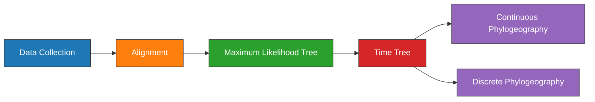

---
aliases:
  - Plague Denmark Phylogeography
---

# Plague Denmark Phylogeography Experiment

| Field   | Value |
| ------- | ----- |
| Project | [[Plague Denmark]]|
| Date    | [[2021-06-16]]      | 

---
## Objectives

1. Estimate a [[Maximum-likelihood\|maximum-likelihood]] [[Phylogenetic\|phylogeny]] of [[Second Pandemic]] [[Plague]] genomes.

---
## Outline



---
## Methods

### Data Collection

#### Code
- SQL statement (Assembly). The only assemblies used are clade [[0.ANT3]] to serve as an outgroup.
	```sql
	SELECT
    	AssemblyFTPGenbank
	FROM
		BioSample
	LEFT JOIN Assembly
		ON AssemblyBioSampleAccession = BioSampleAccession
	WHERE
		(BioSampleComment LIKE '%KEEP%Assembly%Modern%' 
	  	AND length(AssemblyFTPGenbank) > 0 
	  	AND length(BioSampleCollectionDate) > 0
	  	AND length(BioSampleGeographicLocation) > 0)
		AND BioSampleBranch LIKE '%0%ANT3%'
	```
- SQL statement (SRA). The only SRA samples used are clade [[1.PRE]] to be the ingroup.
	```sql
	SELECT
		BioSampleAccession,
	  	SRARunAccession
	FROM
	  	BioSample
	LEFT JOIN SRA
	  	ON SRABioSampleAccession = BioSampleAccession
	WHERE
		(BioSampleComment LIKE '%KEEP%SRA%Ancient%' 
		AND SRAComment NOT LIKE "%REMOVE%")
	  	AND length(BioSampleCollectionDate) > 0
	  	AND length(BioSampleGeographicLocation) > 0	
		AND BioSampleBranch LIKE "%1.PRE%"
	```
- SQL statement (Local). 
	```sql
	SELECT
		BioSampleAccession
	FROM
		BioSample
	WHERE
		(BioSampleComment LIKE '%KEEP%Local%Denmark%')
	```

- Load project:
	```bash
	workflow/scripts/project_load.sh results ../plague-phylogeography-projects/denmark rsync
	```

---
### [[Alignment]]


Pre-processing of the ancient samples and reference-based was performed using the [[nf-core/eager]] pipeline. The [[Snippy|snippy pipeline]] was used to perform variant calling and multiple alignment across all modern and ancient samples.

The output multiple alignment was filtered to only include chromosomal regions, and to exclude sites with excessive missing data. A missing data threshold was selected based on:

- 30% is the final threshold before singletons overtake parsimony sites.
- At 30% missing data, 10% of the alignment is ambiguous characters.

<iframe id="igraph" scrolling="no" style="border:none;" seamless="seamless" src="https://rawcdn.githack.com/ktmeaton/plague-phylogeography-projects/4b5d1f7/denmark/snippy_multi/all/chromosome/full/snippy-multi.snps.missing-data.html" height="540px" width=900px ></iframe>

<iframe id="igraph" scrolling="no" style="border:none;" seamless="seamless" src="https://rawcdn.githack.com/ktmeaton/plague-phylogeography-projects/4b5d1f7/denmark/snippy_multi/all/chromosome/full/snippy-multi.snps.ambig-nuc.html" height="540px" width=900px ></iframe>

#### Code

- Create multiple alignments and plot missing data across sites (no singletons):

	```bash
	snakemake plot_missing_data_all --profile profiles/infoserv
	```


---
### [[Maximum-likelihood]] [[Phylogenetic|Tree]]

Model selection was performed using [[Modelfinder]] and a [[Maximum-likelihood|maximum-likelihood]] tree was estimated across 10 independent runs of [[IQTREE]] using a K3Pu+F+I model. Branch support was evaluated using 1000 iterations of the ultrafast bootstrap approximation  [[Hoang 2018 UFBoot2 Improving Ultrafast|UFBoot]], with a threshold of 95% required for strong support.

```bash
snakemake iqtree_filter_all --profile profiles/infoserv
```

---
### [[Clock Model]] and [[Phylogeography]]

A clock model and geographic model were estimated simultaneously with BEAST 1.10.4

1. Navigate to beast directory:
	```bash
	cd denmark/beast/all/chromosome/full/filter30
	```
2. Run parameters in beauti.
	```yaml
	alignment: beast.fasta
	substitution-model: GTR
	base-frequencies: estimated
	site-heterogeneity-model: None
	clocks:
		- strict clock
		- uncorrelated relaxed clock
	tree-prior: coalescent constant size
	chain-length: 100,000,000
	sample-every: 10,000
	mle: path-sampling
	path-steps: 100
	chain-length: 1,000,000
	```
3. Add Constant Sites
	```xml
	<mergePatterns id="patterns">
		<patterns from="1" every="1">
			<alignment idref="alignment"/>
		</patterns>

		<constantPatterns>
			<alignment idref="alignment"/>
			<counts>
				<parameter value="1126849 1014112 1025137 1123712"/>
			</counts>
		</constantPatterns>
	</mergePatterns>
	```
3. Run the strict clock (~3 minutes/million states)
	```bash
	beast -seed 543545 -threads 10 -beagle_SSE -beagle_double beast_strict_clock.xml | tee beast_strict_clock_screen.log
	
	# Estimated Runtime: 10 hours
	```

4. Run the relaxed clock (~3 minutes/million states)
	```bash
	beast -seed 643543 -threads 10 -beagle_SSE -beagle_double beast_relaxed_clock.xml | tee beast_relaxed_clock_screen.log
	# Estimated Runtime: 10 hours
	```

## Results

---
## Conclusions


---

tags: [[Experiment]], #📝/🌱