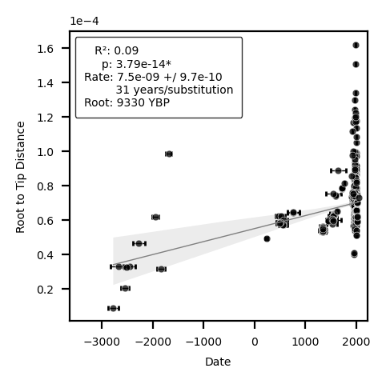

# Plague Phylodynamics and Phylogeography Outline

## Concepts

- [[Plague]]
- [[Yersinia pestis]]
- [[Phylodynamics]]
- [[Phylogeography]]
- [[Clade]]

## Introduction

  - Introduce [[Plague]] the disease and it's impact on [[Human]] populations.
  - Introduce the pathogen, [[Yersinia pestis]], ecotypes, subspecies, ecology, distribution. Evolutionary history and mechanisms.
  - Introduce the topics [[phylodynamics]] and [[phylogeography]] and what is known so far.
  - Introduce the problem.

---

\pagebreak

## Materials and Methods

### Data Collection

### Data Quality Criteria

### Subsampled Datasets

### Phylogenetic Reconstruction

### Phylodynamics

### Phylogeography

---

\pagebreak

## Results

### Curated Dataset

- Composition: Clades, Hosts, Locations, Time Periods

### [[Phylogeny]]

<iframe id="igraph" scrolling="no" style="border:none;" seamless="seamless" src="https://nextstrain.org/community/ktmeaton/plague-phylogeography-projects@main/main/full/all?d=tree&m=div&onlyPanels&p=full&sidebar=closed" height="900px" width=800px ></iframe>

### [[Phylodynamics]]

[[Yersinia pestis|Y. pestis]] has extreme [[rate variation]] as visualized with a [[Root to Tip Regression]]. The R2 value of 0.09 indicates a poor fit to the [[Clock Model|strict clock]]. 

---

\pagebreak

## Discussion

---

\pagebreak

## Conclusion