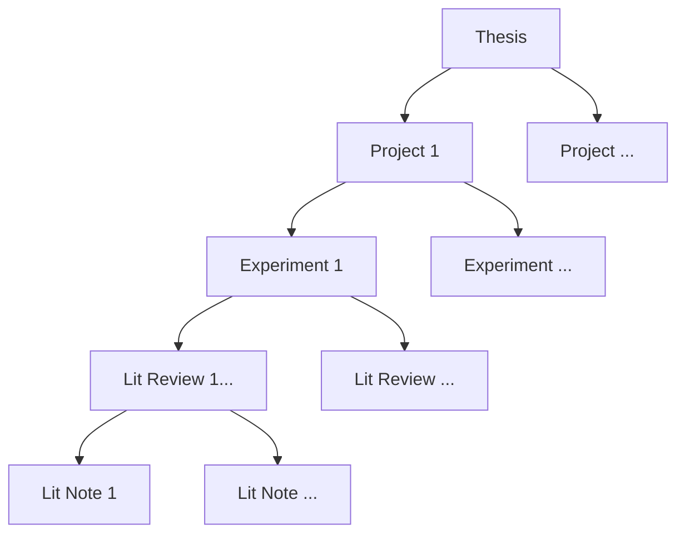

# Katherine Eaton's Academic Obsidian Vault

## Slides

- (https://ktmeaton.github.io/obsidian-public/blob/master/academic/2021-06-08%20Poinar%20Lab%20Meeting.html)

## Papers

- [[[Plague Phylodynamics and Phylogeography Paper]]](https://ktmeaton.github.io//obsidian-public/academic/Plague%20Phylodynamics%20and%20Phylogeography%20Paper.html)

## Note Hierarchy

[[Literature]] notes are the [[building blocks of writing]]. "Literature" can be more broadly defined as content produced by others such as articles, books, videos, software, webpages, etc.

## Tag Taxonomy

### Kanban 

| Tag    | Status      |
|:------:|:--------:|
| #📋 | Idea     |
| #🚂 | Backlog  |
| #🧨 | Priority |
| #✨ | Done     |

### Note Types

|      Type      |     Description     |
|:--------------:|:-------------------:|
|    [[Note]]    |    Generic Note     |
|   [[People]]   |  Individual Humans  |
|    [[Tool]]    |      Software       |
|    [[MOC]]     |   Map of Content    |
|    [[Task]]    |        Task         |
|   [[Video]]    | Youtube, Movie, etc.                    |
| [[Literature]] | Article, Book, etc. |
|  [[Meeting]]   |      A Meeting      |
| [[Conference]] |    A Conference     |
|  [[Workshop]]  |     A Workshop      |

### Note Growth

|  Tag   |    Use    |
|:------:|:---------:|
| #📝/🌱 | Seedling  | 
| #📝/🌿 | Fledgling |
| #📝/🌲 | Evergreen |

### Inputs

|  Tag   |   Use   |
|:------:|:-------:|
| #📥/📰 | Article |
| #📥/📗 |  Book   |
| #📥/📽  |  Video  | 

## Kanban

![[Kanban]]

## [[Graph Groups]]

| Query       | Color   |
| ----------- | ------- |
| [[Project]] | #8000FF |
| [[Tool]]    | #80FFB4 |

## PhD Timeline

![[PhD Timeline]]
