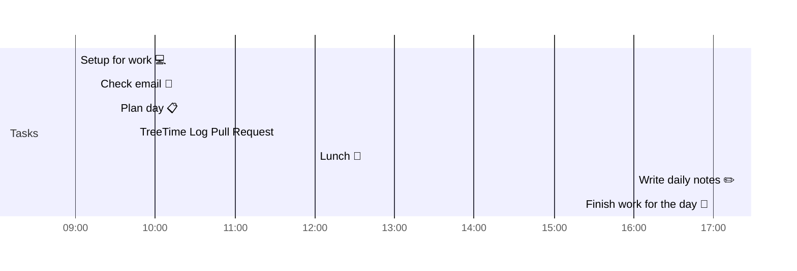

# 📆 2021-04-12

Before planning a day, reflect on the [[PhD Timeline]]. Does what you [[want to do]] match what you [[need to do]]?

## PhD Timeline

![[PhD Timeline]]

## Day Planner


- [x] 09:00 Setup for work 💻
- [x] 09:15 Check email 📧
- [x] 09:30 Plan day 📋
- [x] 09:45 TreeTime Log Pull Request
- [x] 12:00 Lunch 🍙
- [ ] 16:00 Write daily notes ✏️
- [ ] 17:00 Finish work for the day 🎉

## Tasks

### Due Today

```query
line:("⬜/🧨 | [[2021-04-12]]") -path:README -path:Kanban -path:journal -path:templates
```

### Done Today

```query
line:("⬜/✨ | [[2021-04-12]]") -path:README -path:Kanban -path:journal -path:templates
```


### Upcoming

```query
line:(⬜/🧨 -2021-04-12) -path:README -path:Kanban -path:journal -path:templates
```

---

tags: [[Journal]]  
prev: [[2021-04-09]]  
next: [[2021-04-13]]  
scratch: [[scratch/2021-04-12 Scratch|2021-04-12 Scratch]]