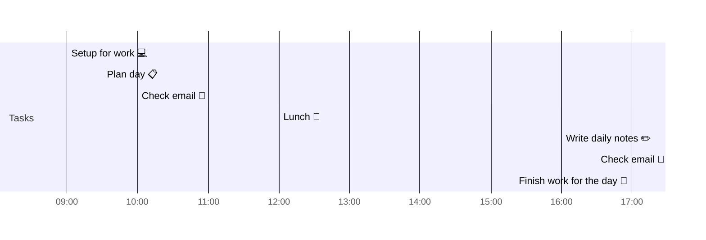

# 📆 2021-04-13

Before planning a day, reflect on the [[PhD Timeline]]. Does what you [[want to do]] match what you [[need to do]]?

## PhD Timeline

![[PhD Timeline]]

## Day Planner


- [x] 09:00 Setup for work 💻
- [x] 09:30 Plan day 📋
- [x] 10:00 Check email 📧
- [x] 12:00 Lunch 🍙
- [x] 16:00 Write daily notes ✏️
- [x] 16:30 Check email 📧
- [x] 17:00 Finish work for the day 🎉

## Tasks

### Due Today

```dataview
table due, project, tags
from "tasks"
where !contains(status, "done") and due=date(2021-04-13)
sort due
```

### Done Today

```dataview
table due, project, tags
from "tasks"
where contains(status, "done") and due=date(2021-04-13)
sort due
```

### Upcoming

```dataview
table due, project, tags
from "tasks"
where !contains(status, "done") and !contains(status, "idea") and due!=date(2021-04-13)
sort due
```

---

tags: [[Journal]]  
prev: [[2021-04-12]]  
next: [[2021-04-14]]  
scratch: [[scratch/2021-04-13 Scratch|2021-04-13 Scratch]]