# 📆 2021-04-26

Before planning a day, reflect on the [[PhD Timeline]]. Does what you [[want to do]] match what you [[need to do]]?

## PhD Timeline

![[PhD Timeline]]

## Day Planner

```mermaid
gantt
    dateFormat  HH-mm
    axisFormat %H:%M
    %% Current Time: 9:12:42 PM
    section Tasks
    Setup for work 💻     :08-30, 30mm
    [[Bison Metadata for Tyler]]     :09-00, 60mm
    Check email 📧/Plan day 📋     :10-00, 30mm
    Monthly Invoice 💲     :10-30, 30mm
    [[Integrate plague-phylogeography-paper as Submodule]]     :11-00, 60mm
    Lunch 🍙     :12-00, 240mm
    Write daily notes ✏️     :16-00, 30mm
    Check email 📧     :16-30, 90mm
    [[Meet With Australia]]     :18-00, -60mm
    Finish work for the day 🎉     :17-00, 0mm
    section Breaks

```


- [x] 08:30 Setup for work 💻
- [x] 09:00 [[Bison Metadata for Tyler]]
- [x] 10:00 Check email 📧/Plan day 📋
- [x] 10:30 Monthly Invoice 💲
- [x] 11:00 [[Integrate plague-phylogeography-paper as Submodule]]
- [x] 12:00 Lunch 🍙
- [x] 16:00 Write daily notes ✏️
- [x] 16:30 Check email 📧
- [x] 18:00 [[Meet With Australia]]
- [x] 17:00 Finish work for the day 🎉

## Tasks

### Overdue

```dataview
table due, project, tags
from "tasks"
where contains(status, "priority") and !contains(status, "done") and due<date(2021-04-26)
sort due
```


### Due

```dataview
table due, time, project, tags
from "tasks"
where status!="done" and due=date(2021-04-26)
sort due
```

### Done

```dataview
table due, time, project, tags
from "tasks"
where status="done" and due=date(2021-04-26)
sort due
```

### Upcoming

```dataview
table due, time, project, tags
from "tasks"
where status!="done" and status!="idea" and due>date(2021-04-26)
sort due
```

---

prev: [[2021-04-23]]  
next: [[2021-04-27]]  