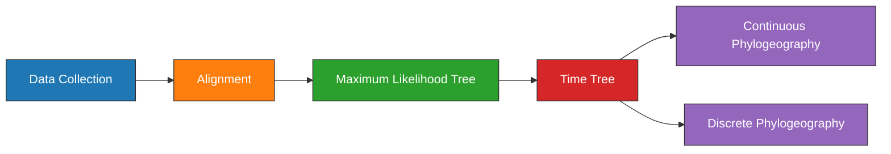

---
aliases:
  - BEAST Experiment
  - plague-phylogeography BEAST Experiment
title:
  - BEAST Experiment
tags:
  - ⬜/🧨 
status:
  - priority
---

# BEAST Experiment

| Field   | Value       |
| ------- | ----------- |
| Project | [[plague-phylogeography]] |
| Date    | [[2021-03-31]]            |

## Objectives
---

1. Estimate a global phylogeny of modern and ancient [[Yersinia pestis]].
1. Visualize the geographic [[Spread|dispersal]] of specific clades on a map.
1. Discuss the variance observed in the spatiotemporal results.

## Outline
---



## Methods
---

### Data Collection

615 [[Yersinia pestis|Y. pestis]] genomic projects were identified from the NCBI databases using [[NCBImeta]]. Of these projects, 553 (90%) were modern in origin and 61 (10%) were ancient. Collection date and location were curated by cross-referencing the original publications.  [[Geocode|Geocoding]] was performed using [[GeoPy]] and the [[Nominatim|Nominatim API]] for [[OpenStreeMap]]. Latitude and longitude for each sample were standardized at the levels of country and state. 

| [[Geographic]] and [[Temporal\|temporal]] [[Distribution\|distribution]] of [[Plague\|plague]] [[Genome\|genomic]] records. |
| ------------------------------------------------------------------------------------------------------------------- |
| ![[eaton2021PlaguePhylogeography_plotly-map.png]]                                                                   |
|                                                                                                                     |


#### Code
- SQL statement (Assembly):
	```sql
	SELECT
    	AssemblyFTPGenbank
	FROM
		BioSample
	LEFT JOIN Assembly
		ON AssemblyBioSampleAccession = BioSampleAccession
	WHERE
		BioSampleComment LIKE '%KEEP%Assembly%Modern%' 
	  	AND length(AssemblyFTPGenbank) > 0 
	  	AND length(BioSampleCollectionDate) > 0
	  	AND length(BioSampleGeographicLocation) > 0
	```
- SQL statement (SRA):
	```sql
	SELECT
		BioSampleAccession,
	  	SRARunAccession
	FROM
	  	BioSample
	LEFT JOIN SRA
	  	ON SRABioSampleAccession = BioSampleAccession
	WHERE
		(BioSampleComment LIKE '%KEEP%SRA%Ancient%' 
		AND SRAComment NOT LIKE "%REMOVE%")
	  	AND length(BioSampleCollectionDate) > 0
	  	AND length(BioSampleGeographicLocation) > 0		
	```
- Load project:
	```bash
	workflow/scripts/project_load.sh results ../plague-phylogeography-projects/main rsync
	```
- Create metadata sheet:
	```bash
	snakemake metadata_all \
	  --profile profiles/infoserv   \
	  --configfile results/config/snakemake.yaml
	```
- Upload to [[Plotly Chart Studio]] and create map plot.

### [[Alignment]]
---

Pre-processing of the ancient samples and reference-based was performed using the [[nf-core/eager]] pipeline. The [[Snippy|snippy pipeline]] was used to perform variant calling and multiple alignment across all modern and ancient samples.

The output multiple alignment was filtered to only include chromosomal regions, and exclude sites that were singletons or had more than 5% missing data.

|                                                      |
| ---------------------------------------------------- |
| ![[eaton2021PlaguePhylogeography_missing-sites.jpg]] |
|                                                      |

#### Code

- Create multiple alignments and plot missing data across sites (no singletons):

	```bash
	snakemake plot_missing_data_all \
	  --profile profiles/infoserv \
	  --configfile results/config/snakemake.yaml
	# Cleanup tmp files
	rm results/snippy_multi/all/*.tmp
	```


### [[Maximum-likelihood]] [[Phylogenetic|Tree]]
---
Model selection was performed using [[Modelfinder]] and a [[Maximum-likelihood|maximum-likelihood]] tree was estimated across 10 independent runs of [[IQTREE]] using a K3Pu+F+I model.

### [[Timetree|Time Tree]]

A time-scaled [[Phylogenetic|phylogeny]] was estimated with [[TreeTime]]  using an [[Clock Model|uncorrelated relaxed clock]] with a diffuse normal prior on the mean [[Substitution Rate|substitution rate]], and a [[Tree Prior|skyline coalescent tree prior]].  The clock estimation procedure was run iteratively until convergence (X iterations).

#### Code
1. Estimate a ML tree.
	```bash
	snakemake iqtree_scf_all \
	  --profile profiles/infoserv \
	  --configfile results/config/snakemake.yaml	
	```
1. Identify and plot the clock model:
	```bash
	snakemake clock_plot_all \
		  --profile profiles/infoserv \
		  --configfile results/config/snakemake.yaml	
	```
1. Should I bootstrap the tree now?
	```bash
	iqtree \
	  -s clock_model.fasta
	  -te clock_model_divtree.nwk \
	  -m K3Pu+F+I \
	  -b 100 \
	  -pre test
	```


### [[Continuous]] [[Phylogeography]]
[[Continuous]] trait phylogeography was performed using the [[GEO_SPHERE]] package in [[BEAST|BEAST2]] using a fixed tree.

```bash
mkdir beast1 beast2 beast3 beastMC3;
sed  "s/beast.trees/beast1.trees/g" beast.xml | sed "s/beast.log/beast1.log/g" > beast1/beast1.xml;
sed  "s/beast.trees/beast2.trees/g" beast.xml | sed "s/beast.log/beast2.log/g" > beast2/beast2.xml;
sed  "s/beast.trees/beast3.trees/g" beast.xml | sed "s/beast.log/beast3.log/g" > beast2/beast3.xml;
cp beast.xml beastMC3/beastMC3.xml;
```

```
<run id="mcmc" spec="beast.coupledMCMC.CoupledMCMC" chainLength="10000000" chains="4" target="0.234" logHeatedChains="true" deltaTemperature="0.1" optimise="true" resampleEvery="1000" >
```

```
screen -S beast-runs
beast -overwrite -threads 5 -beagle -seed 10000000 beast1.xml | tee beast1.screenlog
beast -overwrite -threads 5 -beagle -seed 20000000 beast2.xml | tee beast2.screenlog
beast -overwrite -threads 5 -beagle -seed 30000000 beast3.xml | tee beast3.screenlog
beast -overwrite -threads 5 -beagle -seed 40000000 beastMC3.xml | tee beastMC3.screenlog
```

#### Code

1. Create directory:
	```bash
	snakemake beast_geo_all -np --profile profiles/infoserv
	```
1. Run Parameters:
	```YAML
	alignment:
	  - beast.fasta
	spherical-geometry:
	  - trait: geo
	  - tree:  clock_model_beauti.nex
	  - lat:   clock_model_lat.tsv
	  - lon:   clock_model_lon.tsv
	clock-model: relaxed-clock-log-normal
	MCMC:
	  - chain-length: 10,000,000
	  - sample-every: 1000
	  - tree-every:   1000
	  - screen-every: 1000
	output: beast.xml
	```
1. Run the analysis.
	```bash
	beast -seed 45740554 -threads 4 -beagle_SSE -beagle_double beast.xml | tee beast_screen.log
	```
	- Sampling rate: X/Msamples

##### Preview

- Preview states in the trace:
	```bash
	 header=`grep "#" main_trace.log  | wc -l`
	 states=100;
	 lines=`echo "$(( $header + 2 + $states ))"`
	 head -n $lines main_trace.log > main_trace_100000.log
	```
- Preview the distribution of trees:
	```bash
	 header=`grep -v "tree STATE" main.trees | wc -l`;
	 states=100;
	 lines=`echo "$(( $header + 1 + $samples ))"`	
	 head -n $lines main.trees > main_100000.trees
	```
- Preview the MCC tree.
	```bash
	treeannotator -burnin 10 -hpd2D 0.95 main_100000.trees main_100000_mcc_hpd95.nex
	```

##### Post

1. [ ] Examine the tracelog with [[Tracer]].
1. [ ] Examine the distribution of trees with [[DensiTree]].
1. [ ] Create an [[Maximum Clade Credibility|MCC]] tree with [[TreeAnnotator]].
	```bash
	treeannotator -burnin 10 -hpd2D 0.95 main.trees main_mcc_hpd95.nex
	```
1. [ ] Create a geospatial visualization with [[spreaD3]].

| [[Spread\| Dispersal]] of  [[Y. pestis]] during the [[LNBA]] |
| ---------------------------------------------------- | ------------------------------------------------ |
| ![[eaton2021PlaguePhylogeography_spreaD3-0.PRE.jpg]] |                                                  |

## Results

---

## Conclusions


---

tags: [[Experiment]]