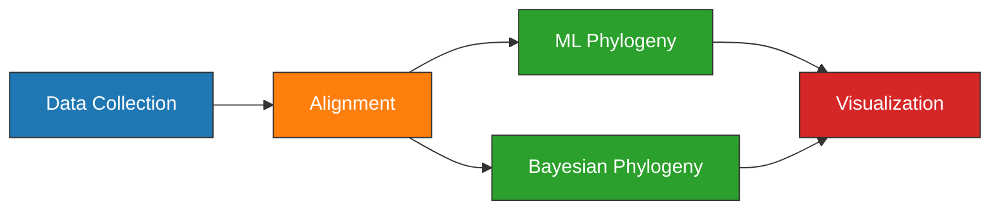

---
aliases:
  - plague-phylogeography BEAST2 Experiment
---

# BEAST2 Experiment

| Field   | Value       |
| ------- | ----------- |
| Project | [[plague-phylogeography]] |
| Date    | [[2021-03-31]]            |

---
## Objectives

1. Estimate a global phylogeny of modern and ancient [[Yersinia pestis]].
1. Visualize the geographic [[Spread|dispersal]] of specific clades on a map.
1. Discuss the variance observed in the spatiotemporal results.

---
## Outline



---
## Methods

### Data Collection

614 [[Yersinia pestis|Y. pestis]] genomic projects were identified from the NCBI databases using [[NCBImeta]]. Of these projects, 553 (90%) were modern in origin and 61 (10%) were ancient. Collection date and location were curated by cross-referencing the original publications.  [[Geocode|Geocoding]] was performed using [[GeoPy]] and the [[Nominatim|Nominatim API]] for [[OpenStreeMap]]. Latitude and longitude for each sample were standardized at the levels of country and state. 

| Geographic and temporal distribution of plague genomic records. |
| --------------------------------------------------------------- |
| ![[eaton2021PlaguePhylogeography_plotly-map.png]]               |
|                                                                 |


#### Code
- SQL statement (Assembly):
	```sql
	SELECT
    	AssemblyFTPGenbank
	FROM
		BioSample
	LEFT JOIN Assembly
		ON AssemblyBioSampleAccession = BioSampleAccession
	WHERE
		BioSampleComment LIKE '%KEEP%Assembly%Modern%' 
	  	AND length(AssemblyFTPGenbank) > 0 
	  	AND length(BioSampleCollectionDate) > 0
	  	AND length(BioSampleGeographicLocation) > 0
	```
- SQL statement (SRA):
	```sql
	SELECT
		BioSampleAccession,
	  	SRARunAccession
	FROM
	  	BioSample
	LEFT JOIN SRA
	  	ON SRABioSampleAccession = BioSampleAccession
	WHERE
		(BioSampleComment LIKE '%KEEP%SRA%Ancient%' 
		AND SRAComment NOT LIKE "%REMOVE%")
	  	AND length(BioSampleCollectionDate) > 0
	  	AND length(BioSampleGeographicLocation) > 0		
	```
- Load project:
	```bash
	workflow/scripts/project_load.sh results ../plague-phylogeography-projects/main rsync
	```
- Create metadata sheet:
	```bash
	snakemake metadata_all \
	  --profile profiles/infoserv   \
	  --configfile results/config/snakemake.yaml
	```
- Upload to [[Plotly Chart Studio]] and create map plot.

---
### [[Alignment]]

Pre-processing of the ancient samples and reference-based was performed using the [[nf-core/eager]] pipeline. The [[Snippy|snippy pipeline]] was used to perform variant calling and multiple alignment across all modern and ancient samples.

The output multiple alignment were filtered to only include chromosomal regions, and exclude sites that were singletons or had more than 5% missing data.

|                                                      |
| ---------------------------------------------------- |
| ![[eaton2021PlaguePhylogeography_missing-sites.jpg]] |
|                                                      |

#### Code

- Create multiple alignments and plot missing data across sites (no singletons):

	```bash
	snakemake plot_missing_data_all \
	  --profile profiles/infoserv \
	  --configfile results/config/snakemake.yaml
	# Cleanup tmp files
	rm results/snippy_multi/all/*.tmp
	```


### [[ML]] [[Phylogeny]]

Model selection was performed using [[Modelfinder]] and a [[Maximum-likelihood|maximum-likelihood]] tree was estimated across 10 independent runs of [[IQTREE]] using the K3Pu+F+I model. Branch support was evaluated using 1000 iterations of the ultrafast bootstrap approximation ([[UFboot]]) and site concordance factors ([[sCF]]). A branch was considered to have strong support if UFboot >= 95 and sCF >= 95%.


#### Code
1. Estimate a ML tree.
	```bash
	snakemake iqtree_scf_all \
	  --profile profiles/infoserv \
	  --configfile results/config/snakemake.yaml	
	```


### [[BEAST2|Bayesian]] [[Phylogeny]]

#### Code

##### Setup
1. Create directory and copy input alignment:
	```bash
	mkdir -p main/beast/all
	cd main/beast/all
	cp ../../snippy_multi/all/snippy-core_chromosome.snps.filter5.aln main.fasta
	```
1. Format tip dates file:
	```bash
	tail -n+2 ../../metadata/all/metadata.tsv  | while read line;
	do
	  sample=`echo -e "$line" | cut -f 1`;
	  date=`echo -e "$line" |
	        cut -f 4 |
			sed -E -e 's/-|\[|\]//g' |
			cut -d ":" --output-delimiter " " -f 1,2 | 
			awk -F " " '{if (NF > 1){av=($1 + $2)/2; printf "%1.0f\n", av} else {print $1}}'`;
	  echo -e "$sample\t$date";
	done > main_dates.tsv
	echo -e "Reference\t29" >> main_dates.tsv
	```
1. Prep latitude and longitude files:
	```bash
	tail -n+2 ../../metadata/all/metadata.tsv  | 
	  cut -f 1,7,9 | awk -F "\t" '{if ($3 == "NA"){print $1"\t"$2} else{print $1"\t"$3}}' > main_lat.tsv
	echo -e "Reference\t38.7251776" >> main_lat.tsv

	tail -n+2 ../../metadata/all/metadata.tsv  | 
	  cut -f 1,8,10 | awk -F "\t" '{if ($3 == "NA"){print $1"\t"$2} else{print $1"\t"$3}}' > main_lon.tsv
	echo -e "Reference\t-105.607716" >> main_lon.tsv
	```
1. Install the [[GEO_SPHERE]] and [[CoupledMCMC]] packages using the [[BEAUti]] GUI package manager:
	```bash
	ssh -X username@remote.com
	ssh -X node
	conda activate plague-phylogeography
	beauti
	```
	
##### [[BEAUti]]

1. Run parameters:
	```yaml
	alignment: main.fasta
	
	tip-dates: 
	  - file: main_dates.tsv
	  - mode: numerically as year before the present
	  
	spherical-geometry:
	  - trait-name: geo
	  - lat-file: main_lat.tsv
	  - lon-file: main_lon.tsv
	 
	site-model:
	  - modern:
	    - gamma-category-count: 0
	    - proportion-invariant: 0.999
	    - subst-model: HKY
	    - subst-model-params:
	      - kappa: 2.0
	    - frequencies: Estimated
	  - geo:
	    - subst-model: JC69
	    - frequencies: Estimated
	    
	clock-model:
	  modern:
	    - clock: Relaxed Clock Log Normal
	    - discrete-rates: -1
	    - Clock.rate: 0.000001 (estimate)
	  geo:
	    - clock: "Relaxed Clock Log Normal"
	    - discrete-rates: -1
	    - Clock.rate: 1.0	 
	
	priors:
	  - tree: Coalescent Skyline Population
	    - ngroups: 5
	  - mrca:
	    - Marseille.prior:
	      - taxa:
	        - SAMEA3713711
	        - SAMEA3713712
	        - SAMEA3713713
	        - SAMEA3713714
	        - SAMEA3713715
	      - uniform:
	        - lower: 299.0
	        - upper: 301.0
	    - East-Smithfield.prior:
	      - taxa:
	      	- SAMN00715800
	      - uniform:
	        - lower: 671.0
	        - upper: 673.0 
	
	mcmc:
	  - chain-length: 10,000,000
	  - store-every: -1
	  - pre-burnin: 0
	  - num-initialization-attempts: 10
	  - tracelog: 
	    - file-name: modern_trace.log
	    - log-every: 1000
	  - screenlog:
	    - log-every: 1000
	  - treelog:
	    - file-name: modern.trees
	    - log-every: 1000
	 
	```
1. Save output as ```main.xml```.
1. Check storing and logging frequency is the same in xml.
1. Convert to a [[CoupledMCMC]] by replacing the ```<run>``` element with:
```xml
<run id="mcmc" spec="beast.coupledMCMC.CoupledMCMC" chainLength="10000000" chains="4" target="0.234" logHeatedChains="true" deltaTemperature="0.1" optimise="true" resampleEvery="1000" >
```

##### [[BEAST2]]

1. Run the analysis.
	```bash
	beast -seed 113579843 -threads 4 -beagle_SSE -beagle_double main.xml | tee main_screen.log
	
	beast -seed 154554325 -threads 4 -beagle_SSE -beagle_double main_priors.xml | tee main_priors_screen.log
	```
	- Sampling rate: ~2h/Msamples

##### Preview

- Preview states in the trace:
	```bash
	 header=`grep "#" main_trace.log  | wc -l`
	 states=100;
	 lines=`echo "$(( $header + 2 + $states ))"`
	 head -n $lines main_trace.log > main_trace_100000.log
	```
- Preview the distribution of trees:
	```bash
	 header=`grep -v "tree STATE" main.trees | wc -l`;
	 states=100;
	 lines=`echo "$(( $header + 1 + $samples ))"`	
	 head -n $lines main.trees > main_100000.trees
	```
- Preview the MCC tree.
	```bash
	treeannotator -burnin 10 -hpd2D 0.95 main_100000.trees main_100000_mcc_hpd95.nex
	```

##### Post

1. [ ] Examine the tracelog with [[Tracer]].
1. [ ] Examine the distribution of trees with [[DensiTree]].
1. [ ] Create an [[Maximum Clade Credibility|MCC]] tree with [[TreeAnnotator]].
	```bash
	treeannotator -burnin 10 -hpd2D 0.95 main.trees main_mcc_hpd95.nex
	```
1. [ ] Create a geospatial visualization with [[spreaD3]].
2. 
## Results

---

## Conclusions


---

tags: [[Experiment]]