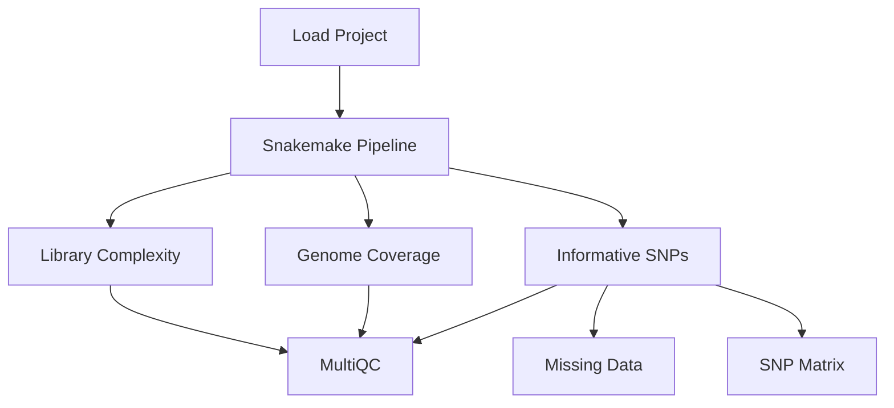

---
aliases:
  - Chromosome Resequencing
---

# Chromosome Resequencing

| Field   | Value      |
| ------- | ---------- |
| Project | [[Plague Denmark]] |
|         |            |


## Objectives

1. Identify [[Yersinia pestis]]-positive samples for [[Resequencing]] based on:
	- [[Library complexity]]
	- [[Genome coverage]], specifically the [[Chromosome]].
	- Informative [[SNP|SNPs]].

## Overview
1. Run the [[plague-phylogeography]] [[snakemake]] pipeline for [[Medieval]] [[Denmark]] samples.
1. [[Preseq]]: Calculate [[complexity curves]].
1. [[Snippy]]: Calculate 
3. Link [[complexity curves]] with:
	- [[Genome coverage]] of the [[Chromosome]].
	- [[SNP]]s identify by [[Snippy]].
4. Identify samples for [[Resequencing]].




## Methods

### Data Preparation

1. Clone the [[plague-phylogeography]] projects repository.

	```bash
	git clone https://github.com/ktmeaton/plague-phylogeography-projects.git /2/scratch/keaton/plague-phylogeography-projects
	```

1. Load the [[Plague Denmark]] into the [[plague-phylogeography]] [[snakemake]] pipeline.

	```bash
	workflow/scripts/project_load.sh results ../plague-phylogeography-projects/denmark rsync
	```
	
### Analysis

1. Run ```eager local``` to generate [[Preseq]] output.

	```bash
	snakemake eager_local --profile profiles/infoserv --configfile results/config/snakemake.yaml
	```

1. Create a [[MultiQC]] report.

	```bash
	snakemake multiqc_local --profile profiles/infoserv --configfile results/config/snakemake.yaml
	```

1. Create a [[snakemake]] report.

	```bash
	mkdir -p results/report/local/
	snakemake multiqc_local --report results/report/local/report.html --profile profiles/infoserv --configfile results/config/snakemake.yaml
	```

#### Manual Analysis

1. 
```bash
for file in `ls results/eager/local/D*/preseq/*L001*.filtered.ccurve`; 
do 
  tail -n 1 $file | awk -v file=`basename $file` '{print file"\t"$2 / $1}'
; done
```


### Upload Results

1. Unload project results.

	```bash
	workflow/scripts/project_unload.sh results ../plague-phylogeography-projects/denmark rsync
	```

1. Upload project results.

	```bash
	cd ../plague-phylogeography-projects/
	git add -A
	git commit -m ""
	git push origin
	```

## Results

| Sample                 | Library                | [[Coverage]] % (3X) | [[SNP]] | Mapped    | Duplicates |
| ---------------------- | ---------------------- | ------------------- | ------- | --------- | ---------- |
| [[SAMN00715800\|8291]] | [[SAMN00715800\|8291]] | 90.04               | 104     | 1,141,530 | 52.97      |
| D24                    | D24                    | 33.35               | 46      | 107,868   | 27.17      |
| D25                    | D25                    | 0.03                | 7       | 2,680     | 20.62      |
| D51                    | D51                    | 70.91               | 118     | 378,558   | 63.95      |
| D62                    | D62                    | 55.23               | 59      | 280,646   | 15.82      |
| D71                    | D71                    | 89.17               | 111     | 1,125,120 | 26.08      |
| D72                    | D72                    | 67.86               | 108     | 316,952   | 33.29      |
| D75                    | D75                    | 89.34               | 144     | 1,048,030 | 14.10      |
|                        |                        |                     |         |           |            |
| P187                   | P187                   | 54.6                | 108     |           |            |
| P212                   |                        | 61.39               | 100     |           |            |
| P246                   |                        | 0.41                | 6       |           |            |
| P384                   |                        | 15.67               | 39      |           |            |
|                        |                        |                     |         |           |            |
| P387                   | P387                   | 58.95               | 95      |           |            |
|                        | P387M2                 |                     |         | 71,235    | 8.68       |
|                        | P387aM3                |                     |         | 55,359    | 16.93      |
|                        | P387bM3                |                     |         | 61,301    | 16.39      |
|                        | P387cM3                |                     |         | 57,186    | 14.48      |
|                        | P387S6aM4              |                     |         | 40,973    | 7.72       |
|                        | P387S6bM4              |                     |         | 41,893    | 8.80       |
|                        | P387S6cM4              |                     |         | 37,227    | 8.72       |
|                        | P387S6dM4              |                     |         | 43,774     | 8.47       |
|                        | P387S6eM4              |                     |         | 40,678     | 7.68       |
|                        | P387S6aM5              |                     |         | 3,729      | 93.22      |
|                        | P387S6bM5              |                     |         | 6,272      | 89.60      |
|                        | P387S6cM5              |                     |         | 8,561      | 85.61      |
|                        |                        |                     |         |           |            |
| R21                    | R21E1S1S2              | 32.12               | 60      | 138,809   | 47.87      |
| R36                    | R36E1S1S2              | 91.4                | 101     | 1,160,240 | 25.86      |
| R44                    | R44E1S1S2              | 0.08                | 30      | 4,927     | 23.46      |

<iframe id="igraph" scrolling="no" style="border:none;" seamless="seamless" src="https://chart-studio.plotly.com/~ktmeaton/1.embed" height="525" width="100%"></iframe>


- The [[Coverage]] of the reference and the Number of [[SNP|SNPs]] is highly related. There 

## Conclusions


---

tags: [[Experiment]]