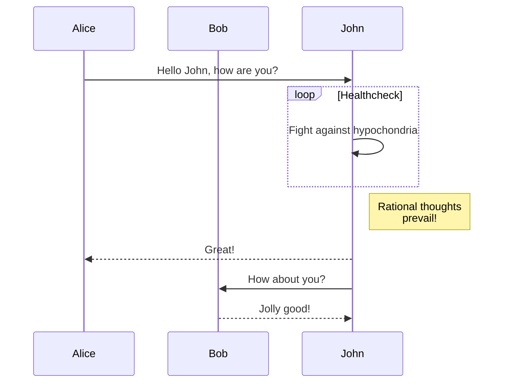
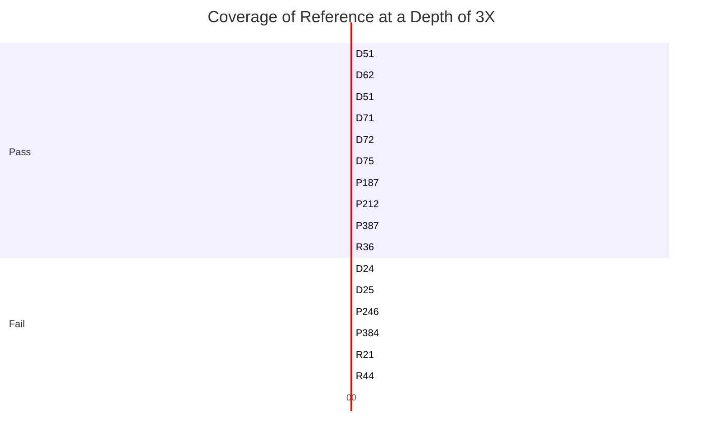
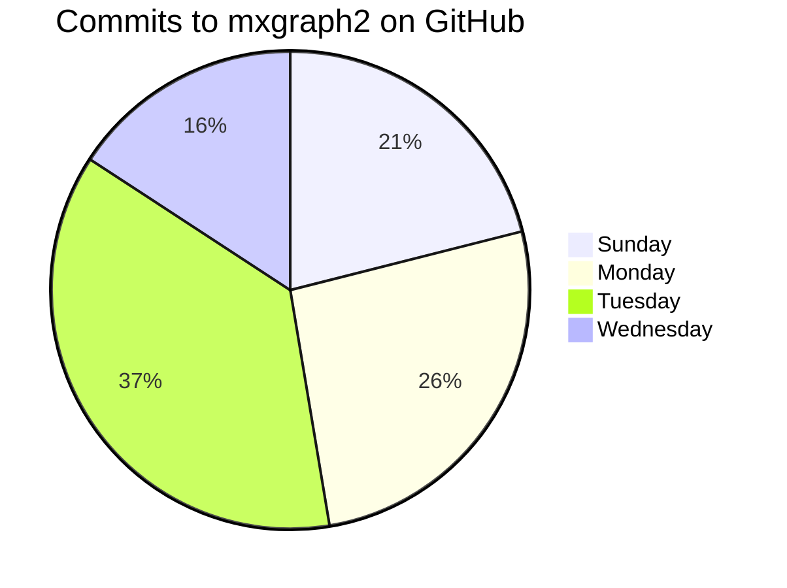
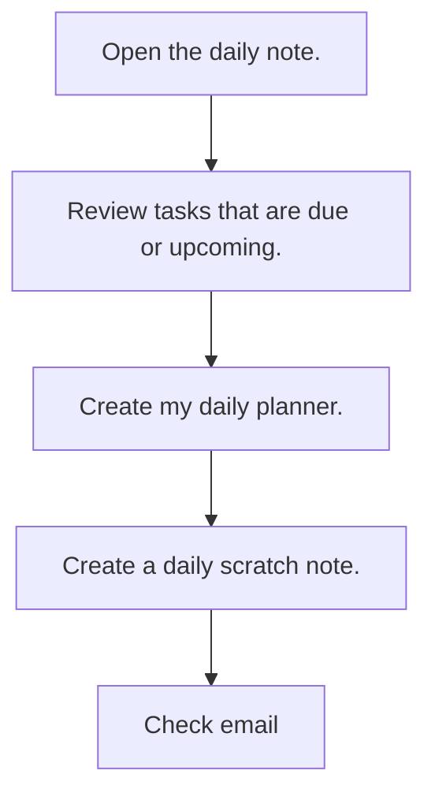

# Mermaid

Flow charts in markdown. 
https://mermaid-js.github.io/mermaid/#/

## Examples
### Flowcharts


### Sequence Diagram


### Gant Diagram

1. General Timeline

	```mermaid
	gantt
	dateFormat  YYYY-MM-DD
	title Adding GANTT diagram to mermaid
	excludes weekdays 2014-01-10

	section A section
	Completed task            :done,    des1, 2014-01-06,2014-01-08
	Active task               :active,  des2, 2014-01-09, 3d
	Future task               :         des3, after des2, 5d
	Future task2               :         des4, after des3, 5d
	```

1. Bar Chart!


### Pie Chart



---

## Daily Obsidian Workflow

1. Open up the Daily Note.
1. Review tasks that due or upcoming.
1. Create my Daily Planner.



tags: [[Tool]]