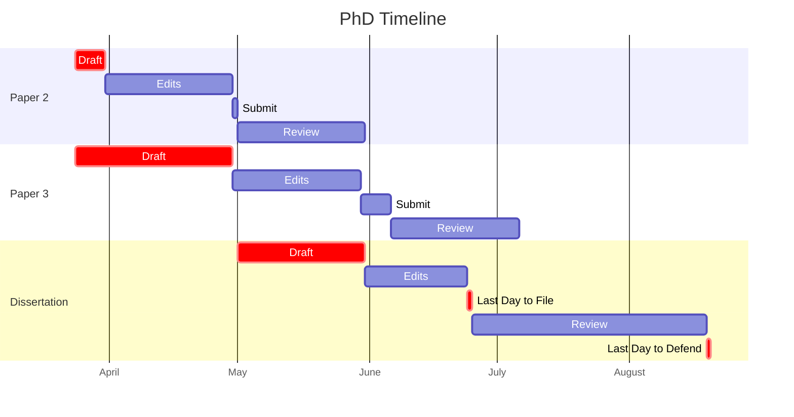

# Katherine Eaton's PhD Obsidian Vault

## PhD Timeline

## Kanban

![[Kanban]]

## Tag Taxonomy

### Kanban 

| Tag    | Use      |
|:------:|:--------:|
| #⬜/🚂 | Backlog  |
| #⬜/📋 | Todo     |
| #⬜/🧨 | Priority |
| #⬜/✨ | Done     | 

### Notes

|  Tag   |    Use    |
|:------:|:---------:|
| #📝/🌱 | Seedling  | 
| #📝/🌿 | Fledgling |
| #📝/🌲 | Evergreen |

### Inputs

|  Tag   |   Use   |
|:------:|:-------:|
| #📥/📰 | Article |
| #📥/📗 |  Book   |
|        |         |

### Status

| Tag |    Use     |
|:---:|:----------:|
| #🟥 |   Inbox    |
| #🟨 | Processing |
| #🟩 |  Complete  | 
| #🟦 |  Archive   |