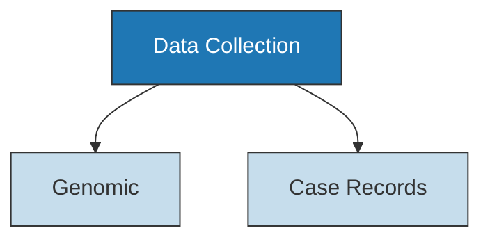
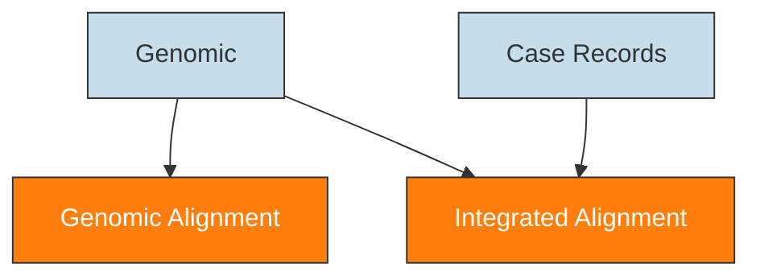
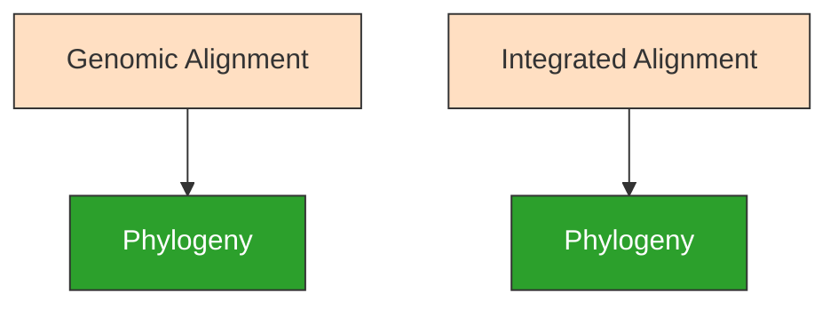

---
aliases:
  - Sampling Bias Experiment
---

# Sampling Bias Experiment

| Field   | Value                     |
| ------- | ------------------------- |
| Project | [[plague-phylogeography]] |
| Date    | [[2021-03-29]]            | 

## Introduction

The [[Geographic Origin|geographic origin]] and [[Spread|spread]] of pathogens can be reconstructed using [[Phylogeography|phylogeography]]. This approach combines [[Phylogenetic|genetic]] data with [[Geospatial|spatial]] and [[Temporal|temporal]] information, such as the sampling location and date. This accessory information is modeled as an [[Evolution|evolutionary]] process alongside the phylogeny, which can then be used to estimate the timing and location of historical events ([[Kalkauskas et al. 2021 Sampling Bias Model|Kalkauskas et al. 2021]]).

However, there remains a central tension in the field of [[phylogeography]] over the appropriate use of this analytical technique. On one hand, [[phylogeography]] is frequently employed as a *discovery* technique to test hypotheses about organisms or events for which there is little prior information.  This framework is typical of [[Ancient DNA|ancient DNA]] studies, where a [[phylogeny]] is constructed from rare ancient specimens. This technique has been used to estimate when and where bacterial diseases first emerged such as plague, syphilis, and tuberculosis ([[Rascovan et al. 2019 Emergence Spread Basal|Rascovan et al. 2019]]; [[Majander et al. 2020 Ancient Bacterial Genomes|Majander et al. 2020]]; [[Sabin 2020 Seventeenth-Century Mycobacterium Tuberculosis|Sabin et al. 2020]]). In these examples, the purpose of [[Phylogeography|phylogeography]] is to generate novel insight where other forms of evidence, such as historical documents, are limited.

On the other side of this tension, is the argument that [[phylogeography]] is a *complementary* technique which requires robust prior knowledge and context. [[Faria et al. 2018 Genomic Epidemiological Monitoring|Faria et al. (2018)]] demonstrated the analytical and interpretive risks associated with using only [[Phylogenetic|phylogenetic]] data to reconstruct the spread of a [[Yellow Fever Virus|Yellow Fever Virus]] outbreak. These risks derived from significant [[Sampling Bias|sampling bias]], specifically [[Under-represented|undersampling]] of [[non-human]] hosts. Similarly, [[Kalkauskas et al. 2021 Sampling Bias Model|Kalkauskas et al. (2021)]] tested through simulation how [[Under-represented|undersampling]] key geographic regions could significantly shift the geographic origin of [[West Nile Virus]] in the [[United Statest of America|USA]]. Intriguingly, the authors found that including [[Sequence-Free|sequence-free]] samples alleviated the effects of severe [[Sampling Bias|sampling bias]]. This novel approach integrates samples with date and location but no genetic information, such as outbreak case-occurrences records ([[Duchene et al. 2019 Inferring Infectious Disease|Duchene et al. 2019]]).

What does this mean for [[Ancient DNA|ancient DNA]] research and the appropriate use of [[phylogeography]]? These findings are exciting for two reasons:

>1. Provides a *statistical argument* for how [[Interdisciplinary|interdisciplinary]] work is critical.
>1. Provides a *methodological framework* for the integration of [[Interdisciplinary|interdisciplinary]] datasets.

The importance of [[interdisciplinary]] approaches has already been gaining momentum within the field of [[Ancient DNA|ancient DNA]] ([[The Black Death Network 2021|The Black Death Network 2021]]). However, one barrier (among many) is the methodological challenge of integrating disparate forms of data. For example, there is great interest in combining genetic, historical, and environmental records to understand past pandemics of plague ([[Schmid et al. 2015 Climate-Driven Introduction Black|Schmid et al. 2015]]; [[Dean et al. 2018 Human Ectoparasites Spread|Dean et al. 2018]]; [[Namouchi et al. 2018 Integrative Approach Using|Namouchi et al. 2018]]). These studies took evidence from evidence and models from multiple disciplines and wove them together in the interpretation phase. In contrast, the [[Sequence-Free|sequence-free]] approach creates a holistic model in the analysis phase, using the diversity of knowledge to statistical correct for bias. In essence these techniques promise that the sum of interdisciplinary knowledge is greater than its parts, and pursues this goal in different ways.

---
## Objectives

Incorporating [[Sequence-Free|sequence-free]] datasets is a relatively recent method for [[Infectious Disease|infectious disease]] research and to date has only been applied to the study of viruses. Furthermore, it has been tested on outbreaks occurring over a relatively small geographic area and time range. It is unknown whether this approach is appropriate for bacterial [[phylogeography]], let alone [[Ancient DNA|ancient DNA]], where genomes are larger (computational burden) and spatiotemporal modeling involves more parameters. This study therefore aims to:

>1. Test whether integrating genetic and [[sequence-free]] datasets can 'correct' genomic sampling-biases in bacterial pathogens.
>2. Test whether this approach is applicable to [[Spread|spread]] reconstructions on a global scale and spanning multiple centuries.

The event and organism of inquiry in this study is the [[Third Pandemic]] of [[Plague|plague]], caused by the bacterium [[Yersinia pestis]]. The rationale for this selection was:

>1. There is significant [[Sampling Bias|sampling biases]] in genomic sequences, namely the [[Over-Represented|oversampling]] of East Asia and the [[Under-represented|undersampling]] of Africa ([[Spyrou et al. 2016 Historical Pestis Genomes|Spyrou et al. 2016]]).
>2. An extensive database of case records was recently assembled by [[Xu et al. 2019 Historical Genomic Data|Xu et al. (2019)]].
>3. [[Yersinia pestis|Y. pestis]] is the most intensively sequenced ancient pathogen, and thus the results of this study are expected to contribute to a great number of research projects.

---
## Methods

### Data Collection



4,552 records of human plague cases dating from 1776 - 2008 were selected to be the case records dataset ([[Xu et al. 2019 Historical Genomic Data|Xu et al. 2019]]). The number of records was randomly subsampled down to 455 (10%).

558 [[Yersinia pestis|Y. pestis]] genomic assembles were identified from the NCBI databases using [[NCBImeta]]. Collection date and location were curated by cross-referencing the original publications. Of the initial 558 genomes, 367 genomes were collected between 1776 - 2008 and are associated with clades causing infection in humans. [[Geocode|Geocoding]] was performed using [[GeoPy]] and the [[Nominatim|Nominatim API]] for [[OpenStreeMap]]. Latitude and longitude for each sample were standardized at the levels of country and state. 

#### Code

- [[SQL]] statement:
	```sql
	SELECT * FROM BioSample
	  WHERE
		(BioSampleComment LIKE '%KEEP%') AND
		(BioSampleBranch NOT LIKE '%0.PE%') AND
		(CAST(BioSampleCollectionDate as date) >= 1776) AND
		(CAST(BioSampleCollectionDate as date) < 2008) AND
		(length(AssemblyFTPGenbank) > 0))
	```
- Create metadata sheet:
	```bash
	snakemake metadata_assembly \
	  --profile profiles/infoserv   \
	  --configfile results/config/snakemake.yaml
	```

### Alignment



The [[Snippy|snippy pipeline]] was used to perform variant calling and multiple alignment. Two separate alignments were constructed:
>1. Genomic Alignment: composed of only genomic records.
>2. Integrated Alignment: composed of genomic and case records.

The output multiple alignments were filtered to only include chromosomal regions, and sites with no more than X% missing data.

#### Code

- Load project:
	```bash
	workflow/scripts/project_load.sh results ../plague-phylogeography-projects/modern rsync
	```
- Create multiple alignment:
	```bash
	snakemake snippy_multi_extract_assembly \
	  --profile profiles/infoserv \
	  --configfile results/config/snakemake.yaml
	```
- Plot the effects of missing data:
	```bash
	snakemake plot_missing_data_assembly \
	  --profile profiles/infoserv \
	  --configfile results/config/snakemake.yaml	
	```

### Phylogeny



Model selection was performed using Modelfinder and a maximum likelihood tree was estimated across 10 independent runs of IQTREE ([[CITE]]). A [[TBD]] model was selected for the genomic alignment and a [[TBD]] model was selected for the integrated alignment. Branch support was evaluated using 1000 iterations of the ultrafast bootstrap approximation (UFboot) and site concordance factors (sCF) ([[CITE]]). A branch was considered to have strong support if UFboot >= 95 and sCF >= 95%.

Clock model.... mugration....

#### Code
- Estimate a [[Maximum-likelihood|maximum likelihood]] phylogeny..
```bash

snakemake iqtree_scf_assembly \
  --profile profiles/infoserv \
  --configfile results/config/snakemake.yaml
```


## Results

### Data Collection

|  Geographic and temporal distribution of plague case records ([[Xu et al. 2019 Historical Genomic Data\|Xu et al. 2019]]).                                               |
| ----------------------------------------------- |
| ![[xu2019HistoricalGenomicData_plotly-map.png]] |
| ![[xu2019HistoricalGenomicData_timeline.jpg]]                                                |

|  Geographic and temporal distribution of plague genomic records.                                                 |
| ----------------------------------------------- |
| ![[eaton2021PlaguePhylogeography_plotly-map.png]] |
| ![[eaton2021PlaguePhylogeography_timeline.jpg]]                                          |


### Alignment

|                                                |
| ----------------------------------------------- |
| ![[eaton2021PlaguePhylogeography_missing-sites.jpg]] |