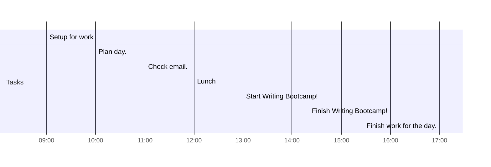

# 📆 2021-03-22

## Day Planner

### Morning

- [x] 09:00 Setup for work
- [x] 10:00 Plan day.
- [x] 11:00 Check email.
- [x] 12:00 Lunch

### Afternoon

- [x] 13:00 Start Writing Bootcamp!
- [x] 16:00 Finish Writing Bootcamp!
- [x] 17:00 Finish work for the day.

## Notes

I created a template for People and added the following:

- [[@Hendrik Poinar]]
- [[@Julia Gamble]]
- [[@Jesper Boldsen]]
- [[@Marie-Helene B Hardy]]

I created a template for Literature and added the following:

- [[Andrades Valtuena et al. 2017 Stone Age Plague]]
- [[Eroshenko et al. 2021 Evolution Circulation Yersinia]]
- [[Rasmussen et al. 2015 Early Divergent Strains]]
- [[Sagulenko et al. 2018 TreeTime Maximum-Likelihood Phylodynamic]]
- 

I discovered you can embed the content of a [[Markdown]] file within another like:

tags: [[Journal]]
prev: [[2021-03-21]]
next: [[2021-03-23]]