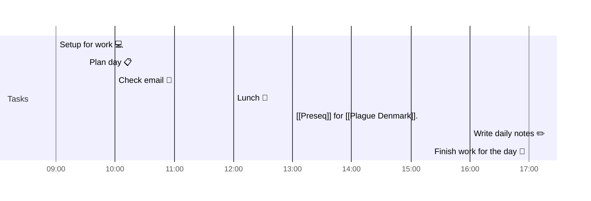

# 📆 2021-03-24

## Day Planner


- [x] 09:00 Setup for work 💻
- [x] 09:30 Plan day 📋
- [x] 10:00 Check email 📧
- [ ] 12:00 Lunch 🍙
- [ ] 13:00 [[Preseq]] for [[Plague Denmark]].
- [ ] 16:00 Write daily notes ✏️
- [ ] 17:00 Finish work for the day 🎉

## Tasks

### Due Today

```query
line:(⬜/🧨 2021-03-24) -path:journal/2021-03-24
```

### Upcoming

```query
line:(#⬜/🧨 -2021-03-24) -path:templates -INDEX
```


## Notes

---

tags: [[Journal]]
prev: [[2021-03-23]]
next: [[2021-03-25]]