# 📆 2021-03-24

## Day Planner

```mermaid
gantt
    dateFormat  HH-mm
    axisFormat %H:%M
    %% Current Time: 5:23:44 PM
    section Tasks
    Setup for work 💻     :09-00, 30mm
    Plan day 📋     :09-30, 30mm
    Check email 📧     :10-00, 120mm
    Lunch 🍙     :12-00, 60mm
    [[Preseq]] for [[Plague Denmark]].     :13-00, 240mm
    Write daily notes ✏️     :17-00, 30mm
    Finish work for the day 🎉     :17-30, 0mm
    section Breaks

```


- [x] 09:00 Setup for work 💻
- [x] 09:30 Plan day 📋
- [x] 10:00 Check email 📧
- [x] 12:00 Lunch 🍙
- [x] 13:00 [[Preseq]] for [[Plague Denmark]].
- [ ] 17:00 Write daily notes ✏️
- [ ] 17:30 Finish work for the day 🎉

## Tasks

### Due Today

```query
line:(⬜/🧨 2021-03-24) -path:journal/2021-03-24
```

### Upcoming

```query
line:(#⬜/🧨 -2021-03-24) -path:templates -INDEX
```

---

tags: [[Journal]]
prev: [[2021-03-23]]
next: [[2021-03-25]]