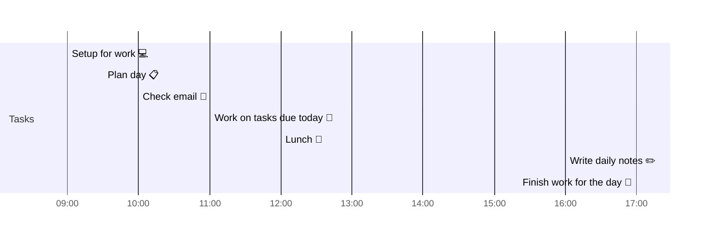

# 📆 2021-03-25

Before planning a day, reflect on the [[PhD Timeline]]. Does what you [[want to do]] match what you [[need to do]]?

## PhD Timeline

![[PhD Timeline]]

## Day Planner


- [x] 09:00 Setup for work 💻
- [x] 09:30 Plan day 📋
- [x] 10:00 Check email 📧
- [x] 11:00 Work on tasks due today 🧨
- [x] 12:00 Lunch 🍙
- [x] 16:00 Write daily notes ✏️
- [x] 17:00 Finish work for the day 🎉
- [ ] BONUS: Try to convert [[Markdown]] to [[Microsoft Word]] using [[Pandoc]]

## Tasks

### Due Today

```query
line:("⬜/🧨 | #2021-03-25") -path:README -path:Kanban -path:journal -path:templates
```

### Done Today

```query
line:("⬜/✨ | #2021-03-25") -path:README -path:Kanban -path:journal -path:templates
```


### Upcoming

```query
line:(⬜/🧨 -2021-03-25) -path:README -path:Kanban -path:journal -path:templates
```

---

tags: [[Journal]]  
prev: [[2021-03-24]]  
next: [[2021-03-26]]  