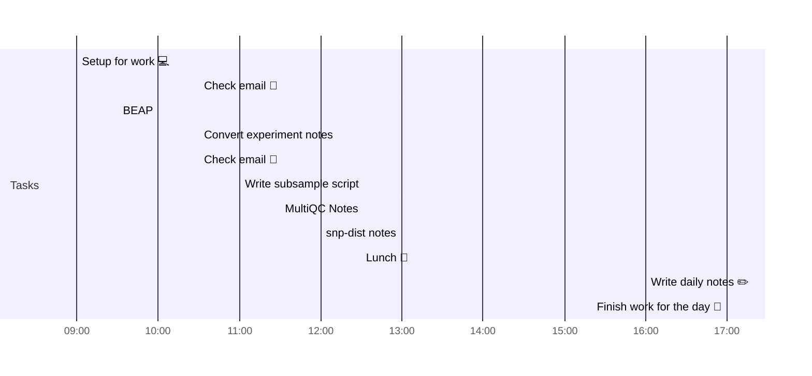

# 📆 2021-03-26

Before planning a day, reflect on the [[PhD Timeline]]. Does what you [[want to do]] match what you [[need to do]]?

## PhD Timeline

![[PhD Timeline]]

## Day Planner


- [x] 09:00 Setup for work 💻
- [x] 10:30 Check email 📧
- [x] 09:30 BEAP
- [x] 10:30 Convert experiment notes
- [x] 10:30 Check email 📧
- [x] 11:00 Write subsample script
- [x] 11:30 MultiQC Notes
- [x] 12:00 snp-dist notes
- [x] 12:30 Lunch 🍙
- [x] 16:00 Write daily notes ✏️
- [x] 17:00 Finish work for the day 🎉

## Tasks

### Due Today

```query
line:("⬜/🧨 | #2021-03-26") -path:README -path:Kanban -path:journal -path:templates
```

### Done Today

```query
line:("⬜/✨ | #2021-03-26") -path:README -path:Kanban -path:journal -path:templates
```


### Upcoming

```query
line:(⬜/🧨 -2021-03-26) -path:README -path:Kanban -path:journal -path:templates
```

---

tags: [[Journal]]  
prev: [[2021-03-25]]  
next: [[2021-03-27]]
scratch: [[scratch/2021-03-26 Scratch]]