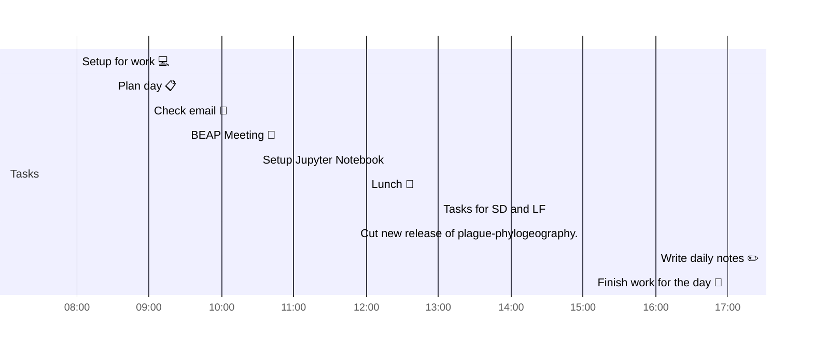

# 📆 2021-04-02

Before planning a day, reflect on the [[PhD Timeline]]. Does what you [[want to do]] match what you [[need to do]]?

## PhD Timeline

![[PhD Timeline]]

## Day Planner


- [x] 08:00 Setup for work 💻
- [x] 08:30 Plan day 📋
- [x] 09:00 Check email 📧
- [x] 09:30 BEAP Meeting 👤
- [x] 10:30 Setup Jupyter Notebook
- [x] 12:00 Lunch 🍙
- [x] 13:00 Tasks for SD and LF
- [ ] 15:00 Cut new release of plague-phylogeography.
- [ ] 16:00 Write daily notes ✏️
- [ ] 17:00 Finish work for the day 🎉

## Tasks

### Due Today

```query
line:("⬜/🧨 | #2021-04-02") -path:README -path:Kanban -path:journal -path:templates
```

### Done Today

```query
line:("⬜/✨ | #2021-04-02") -path:README -path:Kanban -path:journal -path:templates
```


### Upcoming

```query
line:(⬜/🧨 -2021-04-02) -path:README -path:Kanban -path:journal -path:templates
```

---

tags: [[Journal]]  
prev: [[2021-04-01]]  
next: [[2021-04-04]]
scratch: [[scratch/2021-04-02 Scratch|2021-04-02 Scratch]]