# 📆 2021-04-14

Before planning a day, reflect on the [[PhD Timeline]]. Does what you [[want to do]] match what you [[need to do]]?

## PhD Timeline

![[PhD Timeline]]

## Day Planner

```mermaid
gantt
    dateFormat  HH-mm
    axisFormat %H:%M
    %% Current Time: 4:52:11 PM
    section Tasks
    Setup for work 💻     :09-00, 15mm
    Plan day 📋     :09-15, 15mm
    [[2021-04-14 Scratch#35;Email|Check Email]] 📧     :09-30, 30mm
    [[Meet With Ravneet]]     :10-00, 120mm
    Lunch 🍙     :12-00, 240mm
    Write daily notes ✏️     :16-00, 30mm
    Check email 📧     :16-30, 30mm
    Finish work for the day 🎉     :17-00, 60mm
    Get dressed for [[Haidong Gumdo]] ⚔️     :18-00, 0mm
    section Breaks

```


- [x] 09:00 Setup for work 💻
- [x] 09:15 Plan day 📋
- [x] 09:30 [[2021-04-14 Scratch#Email|Check Email]] 📧
- [x] 10:00 [[Meet With Ravneet]]
- [x] 12:00 Lunch 🍙
- [x] 16:00 Write daily notes ✏️
- [ ] 16:30 Check email 📧
- [ ] 17:00 Finish work for the day 🎉
- [ ] 18:00 Get dressed for [[Haidong Gumdo]] ⚔️

## Tasks

### Overdue

```dataview
table due, project, tags
from "tasks"
where contains(status, "priority") and !contains(status, "done") and due<date(2021-04-14)
sort due
```


### Due

```dataview
table due, time, project, tags
from "tasks"
where !contains(status, "done") and due=date(2021-04-14)
sort due
```

### Done

```dataview
table due, project, tags
from "tasks"
where contains(status, "done") and due=date(2021-04-14)
sort due
```

### Upcoming

```dataview
table due, project, tags
from "tasks"
where !contains(status, "done") and !contains(status, "idea") and due>date(2021-04-14)
sort due
```

---

tags: [[Journal]]  
prev: [[2021-04-13]]  
next: [[2021-04-15]]  
scratch: [[scratch/2021-04-14 Scratch|2021-04-14 Scratch]]