# 📆 2021-04-28

Before planning a day, reflect on the [[PhD Timeline]]. Does what you [[want to do]] match what you [[need to do]]?

## PhD Timeline

![[PhD Timeline]]

## Day Planner

```mermaid
gantt
    dateFormat  HH-mm
    axisFormat %H:%M
    %% Current Time: 8:04:26 AM
    section Tasks
    Setup for work 💻     :09-00, 15mm
    Plan day 📋     :09-15, 15mm
    Check email 📧     :09-30, 150mm
    Lunch 🍙     :12-00, 240mm
    Write daily notes ✏️     :16-00, 30mm
    Check email 📧     :16-30, 30mm
    Finish work for the day 🎉     :17-00, 0mm
    section Breaks

```


- [ ] 09:00 Setup for work 💻
- [ ] 09:15 Plan day 📋
- [ ] 09:30 Check email 📧
- [ ] 12:00 Lunch 🍙
- [ ] 16:00 Write daily notes ✏️
- [ ] 16:30 Check email 📧
- [ ] 17:00 Finish work for the day 🎉

## Tasks

### Overdue

```dataview
table due, project, tags
from "tasks"
where status="priority" and status!="done" and due<date(2021-04-28)
sort due
```


### Due

```dataview
table due, time, project, tags
from "tasks"
where status!="done" and due=date(2021-04-28)
sort due
```

### Done

```dataview
table due, project, tags
from "tasks"
where status="done" and due=date(2021-04-28)
sort due
```

### Upcoming

```dataview
table due, project, tags
from "tasks"
where status!="done" and status!="idea" and due>date(2021-04-28)
sort due
```

---

prev: [[2021-04-27]]  
next: [[2021-04-29]]  